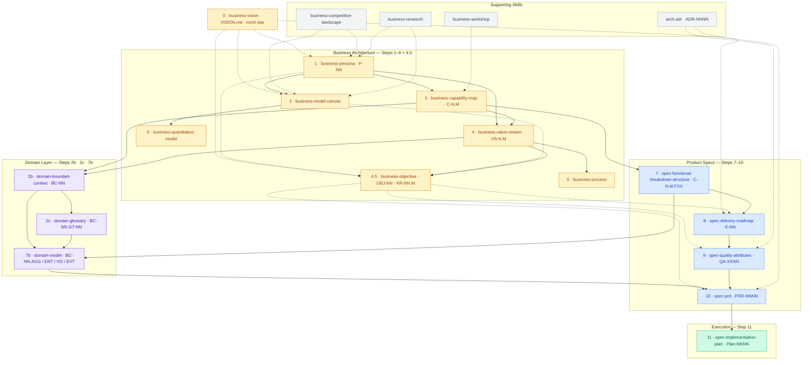

# clew

> *A clew is the corner of a sail you pull to steer — and the thread that guides you through the labyrinth.*

**clew** is an AI-native product intelligence CLI. It is the structured knowledge layer that AI agents (Claude, Codex, and others) use to build, persist, and query the full architecture of a product — from business personas to domain models to delivery epics.

---

## What it does

```bash
clew init                                        # configure clew for a repo
clew new persona "OR Coordinator"                # → P-01
clew new capability "Schedule Management"        # → C-3
clew new functionality "Generate schedule" --cap C-3  # → C-3.1.F01
clew set complexity C-3.1.F01 L
clew new epic "Scheduling core"                  # → E-01
clew link C-3.1.F01 E-01
clew estimate epic E-01                          # → { best: 8d, likely: 12d, worst: 18d }
clew export yaml                                 # → snapshot/ for git readability
```

Agents call clew via Bash. IDs are generated by the DB — never by the LLM. Markdown narrative written by the agent references the IDs returned by clew.

---

## The metamodel

clew manages a complete **strategic-architecture documentation system** across five layers. Skills from [homemade-claude-kit](https://github.com/VictorHueni/homemade-claude-kit) produce the markdown narrative; clew persists the structured records and relationships.

### Artefact layers and build order

16 artefacts across three layers (Business Architecture · Domain · Product Specs) plus a root Step 0. Solid arrows = hard dependency. Dashed arrows = supporting enrichment.



### Data relationships

Each entity **mints** a primary ID and **consumes** upstream IDs as foreign keys. clew enforces these relationships at write time.

```mermaid
erDiagram
    VISION { string file PK }
    PERSONA { string P_NN PK }
    CAPABILITY_MAP { string C_NM PK }
    VALUE_STREAM { string VS_NM PK; string P_NN FK; string C_NM FK }
    BUSINESS_PROCESS { string slug PK; string VS_NM FK }
    BMC { string id PK; string P_NN FK }
    QUANTITATIVE_MODEL { string slug PK }
    OBJECTIVE { string OBJ_NN PK; string VS_NM FK; string P_NN FK }
    KEY_RESULT { string KR_NNM PK; string OBJ_NN FK }
    FBS { string C_NM_FXX PK; string C_NM FK }
    EPIC { string E_NN PK; string C_NM_FXX FK; string VS_NM FK }
    ADR { string ADR_NNNN PK }
    QUALITY_ATTRIBUTES { string QA_XXNN PK; string ADR_NNNN FK; string P_NN FK }
    PRD { string PRD_NNNN PK; string E_NN FK; string QA_XXNN FK; string ADR_NNNN FK }
    IMPLEMENTATION_PLAN { string Plan_NNNN PK; string PRD_NNNN FK }
    BOUNDED_CONTEXT { string BC_NN PK; string C_NM FK; string subdomain_type }
    GLOSSARY_TERM { string BC_NN_GT_NN PK; string BC_NN FK }
    DOMAIN_MODEL { string BC_NN_AGG_NN PK; string BC_NN FK; string C_NM_FXX FK }
    DOMAIN_EVENT { string BC_NN_EVT_NN PK; string BC_NN_AGG_NN FK }

    PERSONA ||--o{ VALUE_STREAM : "triggers"
    PERSONA ||--o{ BMC : "Customer Segments"
    PERSONA }o--o{ QUALITY_ATTRIBUTES : "grounds"
    CAPABILITY_MAP ||--o{ VALUE_STREAM : "stages consume"
    CAPABILITY_MAP ||--|| FBS : "inherits L0 and L1"
    CAPABILITY_MAP }o--o{ BMC : "Key Resources"
    VALUE_STREAM ||--o{ BUSINESS_PROCESS : "operationalised by"
    VALUE_STREAM }o--o{ QUALITY_ATTRIBUTES : "pain index drives"
    VALUE_STREAM }o--o{ EPIC : "VS stage anchor"
    BMC ||--o{ QUANTITATIVE_MODEL : "Revenue and Cost"
    VISION }o--o{ PERSONA : "audience scope"
    VISION }o--o{ OBJECTIVE : "operationalised by"
    VISION }o--o{ BMC : "expressed commercially"
    VALUE_STREAM }o--o{ OBJECTIVE : "pain index informs"
    PERSONA }o--o{ OBJECTIVE : "whose outcomes"
    OBJECTIVE ||--o{ KEY_RESULT : "measured by"
    OBJECTIVE }o--o{ EPIC : "epics serve"
    KEY_RESULT }o--o{ QUALITY_ATTRIBUTES : "targets ground"
    FBS ||--o{ EPIC : "grouped into"
    FBS }o--o{ QUALITY_ATTRIBUTES : "differentiators drive"
    ADR }o--o{ QUALITY_ATTRIBUTES : "decisions inform"
    ADR }o--o{ PRD : "decisions inform"
    EPIC ||--|| PRD : "one PRD per epic"
    QUALITY_ATTRIBUTES ||--o{ PRD : "in acceptance criteria"
    PRD ||--|| IMPLEMENTATION_PLAN : "one plan per PRD"
    CAPABILITY_MAP ||--o{ BOUNDED_CONTEXT : "capabilities group into"
    PERSONA }o--o{ BOUNDED_CONTEXT : "grounds language"
    VALUE_STREAM }o--o{ BOUNDED_CONTEXT : "stage boundaries signal"
    BOUNDED_CONTEXT ||--o{ GLOSSARY_TERM : "scopes GT-NN"
    BOUNDED_CONTEXT ||--o{ DOMAIN_MODEL : "one model per BC"
    FBS ||--o{ DOMAIN_MODEL : "functionalities become entities"
    DOMAIN_MODEL ||--o{ DOMAIN_EVENT : "aggregates produce"
    PRD }o--o{ DOMAIN_MODEL : "references AGG-NN and EVT-NN"
```

---

## Architecture

clew has three layers:

```
AGENT (Claude / Codex)
  calls clew via Bash → gets deterministic IDs back
  writes markdown prose referencing those IDs

CLEW CLI (Typer + DuckDB)
  CRUD commands per entity type
  ID generation via DB sequences — never by the LLM
  FK enforcement at write time
  YAML export → snapshot/ for git readability

MARIMO NOTEBOOKS (read-only analysis)
  Effort estimates + rollup to epics
  Roadmap / Gantt
  KR coverage, financial models
```

Upgrade path: CLI → MCP server → HTTP API, all wrapping the same core layer. See [`docs/architecture/decisions/`](docs/architecture/decisions/) for the full rationale.

---

## Status

Early design phase. ADRs written before code.

## License

MIT
