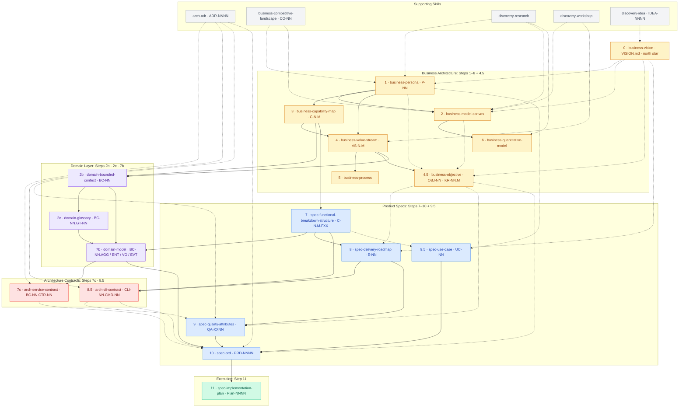

# clew

> *A clew is the corner of a sail you pull to steer, and the thread that guides you through the labyrinth.*

**clew** is an AI-native product intelligence CLI. It is the structured knowledge layer that AI agents (Claude, Codex, and others) use to build, persist, and query the full architecture of a product, from business personas to domain models to delivery epics.

---

## What it does

```bash
clew init                                        # configure clew for a repo
clew new persona "OR Coordinator"                # → P-01
clew new capability "Schedule Management"        # → C-3
clew new functionality "Generate schedule" --cap C-3  # → C-3.1.F01
clew set complexity C-3.1.F01 L
clew new epic "Scheduling core"                  # → E-01
clew link C-3.1.F01 E-01
clew estimate epic E-01                          # → { best: 8d, likely: 12d, worst: 18d }
clew export yaml                                 # → snapshot/ for git readability
```

Agents call clew via Bash. IDs are generated by the DB, never by the LLM. Markdown narrative written by the agent references the IDs returned by clew.

---

## The metamodel

clew manages a complete **strategic-architecture documentation system** across five layers. Skills from [homemade-claude-kit](https://github.com/VictorHueni/homemade-claude-kit) produce the markdown narrative; clew persists the structured records and relationships.

### Artefact layers and build order

19 artefacts across three layers (Business Architecture · Domain · Product Specs) plus a root Step 0 and two Architecture Contract steps. Solid arrows = hard dependency. Dashed arrows = supporting enrichment.



### Data relationships

Each entity **mints** a primary ID and **consumes** upstream IDs as foreign keys. clew enforces these relationships at write time. Each edge is tagged with its **canonical relationship type** — the `UPPERCASE` verb clew stores in `artefact_references.relationship` and validates against the `ALLOWED_RELATIONSHIPS` registry (see the [domain model §Relationship registry](docs/domain/07b-models/artefact-store.md#relationship-registry)); edges left in lowercase prose are softer/advisory links the registry does not type.

```mermaid
erDiagram
    VISION { string file PK }
    PERSONA { string P_NN PK }
    CAPABILITY_MAP { string C_NM PK }
    VALUE_STREAM {
        string VS_NM PK
        string P_NN FK
        string C_NM FK
    }
    BUSINESS_PROCESS {
        string slug PK
        string VS_NM FK
    }
    BMC {
        string id PK
        string P_NN FK
    }
    QUANTITATIVE_MODEL { string slug PK }
    OBJECTIVE {
        string OBJ_NN PK
        string VS_NM FK
        string P_NN FK
    }
    KEY_RESULT {
        string KR_NNM PK
        string OBJ_NN FK
    }
    FBS {
        string C_NM_FXX PK
        string C_NM FK
    }
    EPIC {
        string E_NN PK
        string C_NM_FXX FK
        string VS_NM FK
    }
    ADR { string ADR_NNNN PK }
    QUALITY_ATTRIBUTES {
        string QA_XXNN PK
        string ADR_NNNN FK
        string P_NN FK
    }
    USE_CASE {
        string UC_NN PK
        string P_NN FK
        string C_NM_FXX FK
    }
    COMPETITOR {
        string CO_NN PK
        string P_NN FK
    }
    PRD {
        string PRD_NNNN PK
        string E_NN FK
        string QA_XXNN FK
        string ADR_NNNN FK
        string UC_NN FK
    }
    IMPLEMENTATION_PLAN {
        string Plan_NNNN PK
        string PRD_NNNN FK
    }
    BOUNDED_CONTEXT {
        string BC_NN PK
        string C_NM FK
        string subdomain_type
    }
    GLOSSARY_TERM {
        string BC_NN_GT_NN PK
        string BC_NN FK
    }
    DOMAIN_MODEL {
        string BC_NN_AGG_NN PK
        string BC_NN FK
        string C_NM_FXX FK
    }
    DOMAIN_EVENT {
        string BC_NN_EVT_NN PK
        string BC_NN_AGG_NN FK
    }
    INTERFACE_CONTRACT {
        string BC_NN_CTR_NN PK
        string BC_NN FK
        string BC_NN_AGG_NN FK
        string BC_NN_EVT_NN FK
        string ADR_NNNN FK
    }
    CLI_SURFACE {
        string CLI_NN PK
        string BC_NN FK
    }
    CLI_COMMAND {
        string CLI_NN_CMD_NN PK
        string CLI_NN FK
        string C_NM_FXX FK
        string BC_NN_CTR_NN FK
    }
    IDEA {
        string IDEA_NNNN PK
        string graduates_to FK
        string target_id FK
    }

    PERSONA ||--o{ VALUE_STREAM : "TRIGGERS"
    PERSONA ||--o{ BMC : "SEGMENTS · customer segments"
    PERSONA }o--o{ QUALITY_ATTRIBUTES : "GROUNDS_QA · IC/PE"
    CAPABILITY_MAP ||--o{ VALUE_STREAM : "CONSUMES · stages consume"
    CAPABILITY_MAP ||--|| FBS : "INHERITS · L0 + L1"
    CAPABILITY_MAP }o--o{ BMC : "RESOURCES · key resources"
    VALUE_STREAM ||--o{ BUSINESS_PROCESS : "OPERATIONALISES"
    VALUE_STREAM }o--o{ QUALITY_ATTRIBUTES : "pain index drives PE"
    VALUE_STREAM }o--o{ EPIC : "VS stage anchor"
    BMC ||--o{ QUANTITATIVE_MODEL : "QUANTIFIES · revenue + cost"
    VISION }o--o{ PERSONA : "audience scope"
    VISION }o--o{ OBJECTIVE : "operationalised by"
    VISION }o--o{ BMC : "expressed commercially"
    VALUE_STREAM }o--o{ OBJECTIVE : "INFORMS · pain index"
    PERSONA }o--o{ OBJECTIVE : "ADDRESSES · whose outcomes"
    OBJECTIVE ||--o{ KEY_RESULT : "MEASURES"
    OBJECTIVE }o--o{ EPIC : "SERVES · epics serve"
    KEY_RESULT }o--o{ QUALITY_ATTRIBUTES : "targets ground"
    FBS ||--o{ EPIC : "GROUPS · grouped into"
    FBS }o--o{ QUALITY_ATTRIBUTES : "DRIVES · differentiators"
    ADR }o--o{ QUALITY_ATTRIBUTES : "DECIDES · Security/Flex"
    ADR }o--o{ PRD : "DECIDES · architecture"
    EPIC ||--|| PRD : "SPECIFIES · one per epic"
    QUALITY_ATTRIBUTES ||--o{ PRD : "CONSTRAINS · acceptance criteria"
    PERSONA ||--o{ USE_CASE : "ACTOR_OF · primary actor"
    FBS ||--o{ USE_CASE : "COVERS · realised by"
    USE_CASE ||--o{ PRD : "GROUNDS · acceptance criteria"
    PERSONA }o--o{ COMPETITOR : "TARGETS · ICP"
    CAPABILITY_MAP }o--o{ COMPETITOR : "COMPETES_ON · value curve"
    BMC }o--o{ COMPETITOR : "POSITIONS_AGAINST · positioning"
    QUANTITATIVE_MODEL }o--o{ COMPETITOR : "BENCHMARKS · pricing"
    PRD ||--|| IMPLEMENTATION_PLAN : "DETAILS · one plan per PRD"
    CAPABILITY_MAP ||--o{ BOUNDED_CONTEXT : "GROUPS_INTO · capabilities"
    PERSONA }o--o{ BOUNDED_CONTEXT : "GROUNDS_BC · language"
    VALUE_STREAM }o--o{ BOUNDED_CONTEXT : "SIGNALS · boundary"
    BOUNDED_CONTEXT ||--o{ GLOSSARY_TERM : "SCOPES"
    BOUNDED_CONTEXT ||--o{ DOMAIN_MODEL : "MODELS · one per BC"
    FBS ||--o{ DOMAIN_MODEL : "BECOMES · entities"
    DOMAIN_MODEL ||--o{ DOMAIN_EVENT : "EMITS · domain events"
    PRD }o--o{ DOMAIN_MODEL : "REFERENCES_DM · AGG/EVT"
    INTERFACE_CONTRACT }o--o{ ADR : "GOVERNS · versioning + auth"
    INTERFACE_CONTRACT }o--o{ QUALITY_ATTRIBUTES : "SLA per CTR-NN"
    INTERFACE_CONTRACT }o--o{ PRD : "references CTR-NN"
    CLI_SURFACE ||--o{ CLI_COMMAND : "CONTAINS"
    CLI_SURFACE }o--o{ BOUNDED_CONTEXT : "BC scope"
    CLI_SURFACE }o--o{ ADR : "taxonomy + config decisions"
    CLI_COMMAND }o--o{ FBS : "MAPS_TO · C-N.M.FXX"
    CLI_COMMAND }o--o{ EPIC : "scoped by delivery phase"
    CLI_COMMAND }o--o{ QUALITY_ATTRIBUTES : "SLA per command"
    CLI_COMMAND }o--o{ PRD : "references CMD-NN"
    CLI_COMMAND }o--o{ INTERFACE_CONTRACT : "WRAPS · CTR-NN calls"
    IDEA }o--o| PERSONA : "GRADUATES_TO"
    IDEA }o--o| OBJECTIVE : "GRADUATES_TO"
    IDEA }o--o| BMC : "GRADUATES_TO"
    IDEA }o--o| ADR : "GRADUATES_TO"
    IDEA }o--o| FBS : "GRADUATES_TO"
    IDEA }o--o| PRD : "GRADUATES_TO"
```



---

## Architecture

clew has three layers:

```
AGENT (Claude / Codex)
  calls clew via Bash → gets deterministic IDs back
  writes markdown prose referencing those IDs

CLEW CLI (Typer + SQLite)
  CRUD commands per entity type
  ID generation via DB sequences, never by the LLM
  FK enforcement at write time
  YAML export → snapshot/ for git readability

MARIMO NOTEBOOKS (read-only analysis)
  Effort estimates + rollup to epics
  Roadmap / Gantt
  KR coverage, financial models
```

Upgrade path: CLI → MCP server → HTTP API, all wrapping the same core layer. See [`docs/architecture/decisions/`](docs/architecture/decisions/) for the full rationale.

---

## Where to start reading

This repository is its own first project. The artefacts in [`docs/business/`](docs/business/) document clew using clew's own intended methodology, as a worked example for anyone evaluating the approach.

Depending on what you came for:

- **What is clew for?** → [`VISION.md`](docs/VISION.md) + [`docs/business/02a-lean-canvas.md`](docs/business/02a-lean-canvas.md)
- **Who is it built for?** → [`docs/business/01a-personas.md`](docs/business/01a-personas.md) (P-01 Ava, the agent-first product engineer)
- **What can it do? (capabilities)** → [`docs/business/03a-capability-map.md`](docs/business/03a-capability-map.md) (5 L0 domains, 19 L1 capabilities)
- **How does value flow?** → [`docs/business/04a-value-streams.md`](docs/business/04a-value-streams.md) (4 streams, fully decomposed, all triggered by P-01)
- **What are the goals and measures?** → [`docs/business/04b-objectives.md`](docs/business/04b-objectives.md) (3 OKRs, 12 KRs)
- **Why these technical decisions?** → [`docs/architecture/decisions/`](docs/architecture/decisions/) (ADRs ahead of implementation)
- **What does the user research say?** → [`docs/discovery/interviews/`](docs/discovery/interviews/) (wave-1 interview + synthesis, N=1, founder-as-instance)

Every artefact uses **stable IDs** (P-NN, C-N.M, VS-N.M, OBJ-NN, KR-NN.M, ADR-NNNN) and **soft-links** to related artefacts; clicking any ID-tagged link drills into the referenced artefact. Confidence is labelled throughout. Pain ratings and KR targets are anchored on wave-1 N=1 evidence; see the **Confidence-cliff watchpoint** in [`docs/business/04b-objectives.md`](docs/business/04b-objectives.md#obj-03--validate-the-core-hypotheses-before-scaling) for when this evidence base will be refreshed.

---

## Status

Early design phase. Business-layer modelling **complete** (personas, lean canvas, capability map, value streams, objectives, all wired bidirectionally; see §Where to start reading above). Spec + domain layers drafted (FBS, bounded contexts, the Artefact Store domain model, and the CLI interface contract). Architecture layer: **seven ADRs ahead of implementation** in [`docs/architecture/decisions/`](docs/architecture/decisions/) — persistence layer, file binding, schema design, implementation stack, frontmatter policy, type-definition home, and migration framework. **No CLI yet:** the commands shown in §What it does are the target shape, not the current state. Next: implement the `clew` package (ADR-0001/0003/0004/0007).

## License

MIT
