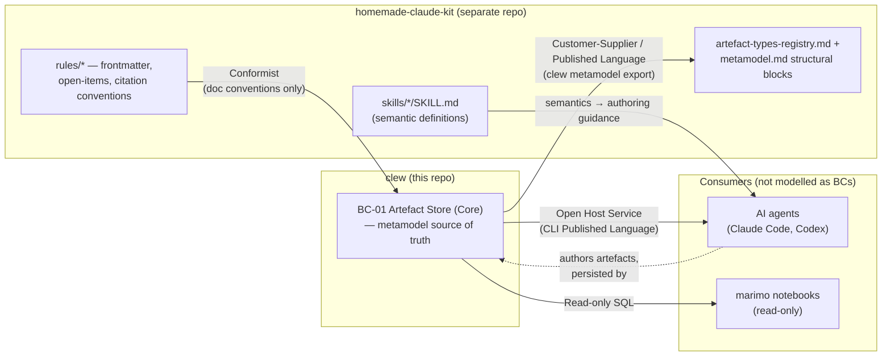

<!-- context-map-version: 2.0 | created: 2026-05-25 | updated: 2026-06-27 (ADR-0008) -->

# clew — Context Map

This document maps the integration patterns for clew's bounded contexts (catalogued in [`02b-bounded-contexts.md`](02b-bounded-contexts.md)). Every relationship names an Evans pattern — no anonymous "they call each other."

> **Updated for [ADR-0008](../architecture/decisions/adr-0008-clew-canonical-source-of-truth-for-metamodel.md).**
> The clew ↔ `homemade-claude-kit` relationship is no longer a single "clew Conformist-downstream-of-kit"
> edge. It is now **partitioned by fact-class**: clew is the **upstream source of truth for metamodel
> *structure & relationships*** (the kit's structural registry is generated from clew); the kit's
> **skills remain the source for *semantics*** (authoring methodology), consumed by agents not by clew;
> and clew stays a **Conformist** consumer of the kit's **cross-cutting doc conventions** only. This
> resolves OI-0058.

> **Methodology:** [Evans DDD (2003) Chapter 14 — eight integration patterns + Vernon DDD Distilled (2016) Chapter 4](https://github.com/VictorHueni/homemade-claude-kit/tree/main/domain-bounded-context/references/methodology-references.md).

**Integration patterns in use (Evans vocabulary):**
- **Customer-Supplier** — clew (Supplier, upstream) publishes the metamodel structure; the kit's
  structural registry (Customer, downstream) regenerates from it. The same maintainer owns both, so the
  downstream has a voice (Customer-Supplier, not Conformist).
- **Published Language** — the structural metamodel clew emits (`docs/metamodel/` today; a
  `clew metamodel export` format later) is the shared contract the kit registry conforms to.
- **Conformist** — clew accepts the kit's **cross-cutting doc conventions** (frontmatter schema,
  open-items governance, citation discipline) as-is. This is the *residual* of the pre-ADR-0008
  relationship, now scoped to conventions, **not** to metamodel structure.
- **Open Host Service** + **Published Language** — clew's CLI v1 contract, published to its non-BC
  callers (agents, scripts).
- *(Not in use at v1: Shared Kernel, ACL, Separate Ways, Big Ball of Mud.)*

---

## Overview

*The structural edge (clew → kit registry) is the ADR-0008 flip — it ran the other way before. The
semantics edge (skills → agents) never touched clew at runtime. The conventions edge (kit rules → clew)
is the scoped-down residual of the old Conformist relationship.*

---

## Relationship definitions

### BC-01 → Customer-Supplier → homemade-claude-kit structural registry (the ADR-0008 flip)

**Upstream context:** BC-01 · Artefact Store (this repo) — **Supplier**
**Downstream context:** `homemade-claude-kit` structural registry — `rules/artefact-types-registry.md` + the structural blocks of `rules/metamodel.md` (ER, ID conventions, canonical paths) — **Customer**
**Integration pattern:** **Customer-Supplier**, with clew publishing a **Published Language**

clew is the canonical source of truth for metamodel *structure and relationships* — which artefact types
exist, their `id_format`/layout/path, the packages, and the legal `ALLOWED_RELATIONSHIPS`. It enforces
all of this at write time, so it owns the definition. The kit's structural registry becomes a **generated
projection**: a future `clew metamodel export` emits the registry rows and the structural ER/ID/path
blocks of `metamodel.md`, and a kit-side CI check asserts no manual drift from that export.

**What crosses the boundary** *(clew → kit):* artefact-type table rows (`type`, `id_format`, `layout`,
`default_path`, `frontmatter_conditionals`, `property_schema_ref`), the relationship catalogue, and the
package taxonomy.

**Why Customer-Supplier, not Conformist:** the same person maintains both repos, so the downstream (kit)
has real influence over the upstream (clew) — they collaborate on the shared structural language rather
than the kit passively accepting whatever clew emits.

**Direction note:** this **reverses** the pre-ADR-0008 edge, where clew's `ARTEFACT_TYPE_CONFIGS` derived
*from* the kit registry. ADR-0006's `property_schema_ref` column already pointed at clew's Pydantic models
— the coupling was always half-flipped.

### BC-01 ← Conformist ← homemade-claude-kit conventions (residual)

**Upstream context:** `homemade-claude-kit` cross-cutting rules — `rules/artefact-frontmatter.md`, `rules/open-items-governance.md`, citation discipline
**Downstream context:** BC-01 · Artefact Store (this repo)
**Integration pattern:** **Conformist** (scoped to conventions)

clew's documents follow the kit's **doc conventions** — the universal frontmatter block, the canonical
`## Open Items` schema, the citation rules — and adopts them as-is. This is what remains of the original
Conformist relationship after ADR-0008 carved the *structural* definitions out and handed them to clew.
It is deliberately narrow: conventions about *how documents are shaped*, never *what artefact types or
relationships exist* (those are now clew's).

### homemade-claude-kit skills → semantics → agents (orthogonal to clew)

**Source:** `skills/*/SKILL.md` § `## Canonical definition` — methodology, anti-patterns, examples
**Consumer:** AI agents authoring artefacts
**Not a clew dependency.** Per [ADR-0008](../architecture/decisions/adr-0008-clew-canonical-source-of-truth-for-metamodel.md),
the **semantic** fact-class stays with the skills — an agent reads `business-persona`'s methodology to
*author* a good persona. clew the CLI never consumes this prose; it only persists the resulting artefact
and enforces its structure. So the semantics flow is modelled here for completeness but is **outside**
clew's runtime integration surface.

---

## Why no internal BC-to-BC relationships

clew at v1 has a single bounded context (BC-01 Artefact Store) — there are no internal BC-to-BC relationships to map. This is documented as a deliberate choice in [02b-bounded-contexts.md §Subdomain catalogue](02b-bounded-contexts.md#subdomain-catalogue) and tracked for re-evaluation as OI-0018 — whose framing ADR-0008 changes: the kit is no longer a pure upstream clew conforms to, so "elevate the kit to BC-02" must now account for clew being the kit's *structural* supplier.

**Non-BC consumers of BC-01** (shown in the Overview diagram for completeness, not modelled as separate BCs):

- **AI agents (Claude Code, Codex, etc.)** consume the CLI as an Open Host Service whose stdout/stderr/exit-code contract is the Published Language (see [CLI interface contract v1](../architecture/interfaces/cli-clew.md)). Agents author artefacts (data) that clew persists, and read the kit skills (semantics) for *how* to author them — neither makes the agent a bounded context within clew's scope.
- **marimo notebooks** consume BC-01 via read-only SQL through the stdlib `sqlite3` driver. They produce analytics views but never write — single-writer concurrency is preserved (per [ADR-0001 §Concurrency model](../architecture/decisions/adr-0001-metamodel-persistence-layer.md#concurrency-model)).

If clew ever introduces a second writer (a web UI, an MCP server with mutating tools), that writer becomes a candidate BC and the context map gains internal relationships.

---

## Open Items

None at present. *(OI-0058 — the partitioned-boundary rewrite — is resolved by this version. The elevation of the kit to BC-02 remains tracked as [`02b-bounded-contexts.md` OI-0018](02b-bounded-contexts.md#open-items), now reframed by ADR-0008.)*

---

## Changelog

| Date | Change | Author |
|---|---|---|
| 2026-05-25 | Initial scaffold + fill in one pass. Single-BC v1 scope (BC-01 Artefact Store) with one external upstream Conformist relationship (`homemade-claude-kit` skill catalogue). | Victor Hueni |
| 2026-06-27 | **v2.0 — partitioned boundary per [ADR-0008](../architecture/decisions/adr-0008-clew-canonical-source-of-truth-for-metamodel.md).** Replaced the single "clew ← Conformist ← kit" edge with three: clew → **Customer-Supplier / Published Language** → kit structural registry (the SoT flip); clew ← **Conformist** ← kit *doc conventions* (residual, scoped); kit skills → *semantics* → agents (orthogonal, not a clew dependency). Overview diagram + pattern list + relationship sections rewritten. Resolves OI-0032; reframes OI-0018. | Victor Hueni |
| 2026-07-24 | Open-items reference renumber (governance sync, no content change): ADR-0008's OI-0032 was renumbered to OI-0058 in the repo-wide collision cleanup (see the central ledger `project-control/open-items/open-items.md`); the banner and §Open Items references here updated to OI-0058 (the 2026-06-27 changelog row above narrates the pre-renumber ID). | Victor Hueni |
