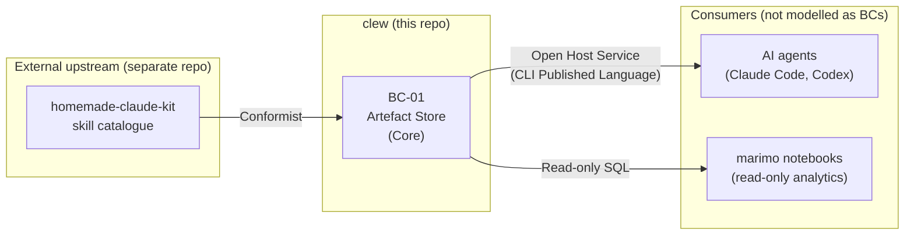

<!-- context-map-version: 1.0 | created: 2026-05-25 -->

# clew — Context Map

This document maps the integration patterns for clew's bounded contexts (catalogued in [`02b-bounded-contexts.md`](02b-bounded-contexts.md)). Every relationship names an Evans pattern — no anonymous "they call each other."

> **Methodology:** [Evans DDD (2003) Chapter 14 — eight integration patterns + Vernon DDD Distilled (2016) Chapter 4](https://github.com/VictorHueni/homemade-claude-kit/tree/main/domain-bounded-context/references/methodology-references.md).

**Integration patterns in use (Evans vocabulary):**
- **Conformist** — downstream accepts the upstream model as-is; no negotiation power. Used here for clew's consumption of the kit's methodology encodings.
- *(Not in use at v1: Shared Kernel, Customer-Supplier, ACL, Open Host Service, Published Language, Separate Ways, Big Ball of Mud. The Published Language and Open Host Service patterns describe what clew itself publishes to its own callers — agents, scripts — but those callers are not modelled as bounded contexts; see §Why no internal BC-to-BC relationships below.)*

---

## Overview

*Edge labels name the integration pattern (upstream → downstream direction). Only one inter-BC relationship is modelled in this map (kit → BC-01); the rightmost edges show how BC-01 exposes itself to non-BC consumers, included for completeness.*

---

## Relationship definitions

### BC-01 ← Conformist ← homemade-claude-kit (external upstream)

**Upstream context:** `homemade-claude-kit` (separate repository: <https://github.com/VictorHueni/homemade-claude-kit>) — **not modelled as a clew-internal BC** ([per §Open Items OI-002 in 02b-bounded-contexts.md](02b-bounded-contexts.md#open-items), elevation to BC-02 is deferred until kit scope or consumer count grows).
**Downstream context:** BC-01 · Artefact Store (this repo)
**Integration pattern:** **Conformist**

*Evans definition: "The downstream team accepts the upstream model as-is, even if it does not perfectly fit their needs, because the downstream team has no influence over the upstream design and the cost of translation is not justified."*

**What crosses the boundary** *(kit → clew):*

- **Artefact-type schemas** — the kit's skills (`business-persona/`, `business-objective/`, `arch-adr/`, …) define which artefact types exist, what fields each type carries, and what authoring discipline applies. clew's `ARTEFACT_TYPE_CONFIGS` (Python constants in `schema.py`) accepts these as-is.
- **ID format patterns** — `P-{nn}`, `OBJ-{nn}`, `KR-{parent_id}.{m}`, `ADR-{nnnn}`, `C{n}.{m}.F{nn}`, `BC-{nn}.GT-{nn}`, etc. The kit publishes these in [`rules/metamodel.md` §Cross-doc ID conventions](https://github.com/VictorHueni/homemade-claude-kit/blob/main/rules/metamodel.md); clew's `id_gen.py` formats per these patterns without modification.
- **Layout conventions** — per-artefact-type `default_path` (e.g. `docs/business/01a-personas.md`, `docs/architecture/decisions/adr-{nnnn}-{slug}.md`) and `file_layout` (`single-collection` / `one-per-artefact` / `inherits-from-parent`) are derived from the kit's `rules/metamodel.md` §Canonical output paths.
- **Authoring templates** — the kit ships `references/template.md` per skill; clew's `C1.1 Methodology-mediated artefact creation` is fully realised by the kit (FBS line 92: *"The 5 shipped functionalities are realised by `homemade-claude-kit` — no clew CLI code required for them."*).
- **Cross-methodology semantics** — when clew's `C5.4` validates that a `persona` reference cannot point at an `ADR`, the *categorisation* of those types into "methodologies" (BIZBOK, BABOK, Strategyzer, Sommerville, …) comes from the kit.

**Translation layer (ACL only):** N/A — this is Conformist, not ACL. clew deliberately does not translate. If the kit renames `business-persona` to `business-stakeholder`, clew adopts the new name in its `ARTEFACT_TYPE_CONFIGS` rather than maintaining a translation map. This is a deliberate choice — the kit-as-upstream is authored by the same person who authors clew, so the "no influence" cost of Conformist is zero in practice. *(If a second downstream consumer of the kit emerges, the no-translation stance should be re-examined — see OI-002 in [02b-bounded-contexts.md](02b-bounded-contexts.md#open-items).)*

**Technical implementation hint:**

- The kit is installed alongside clew via `chezmoi` / dotfiles symlinks to `~/.claude/skills/` (see [skill-creation-sync rule](https://github.com/VictorHueni/homemade-claude-kit/blob/main/rules/skill-creation-sync.md))
- clew reads the kit's `rules/metamodel.md` and per-skill `SKILL.md` files at design time (to populate `ARTEFACT_TYPE_CONFIGS`); the kit is not a runtime dependency of the `clew` CLI itself
- Kit updates flow to clew via a manual `pip install -U clew` after the kit publishes new artefact-type definitions

**Coupling risk:** **Medium**
- Single contributor authors both sides → drift is low and visible
- Kit changes (rename a type, change an ID format, add a layout category) require a matching `schema.py` update in clew; there is no CI check that flags drift today
- Mitigation: when kit changes a metamodel rule, the kit's own `rules/skill-creation-sync.md` §"Maintenance coupling" lists which files in adopting repos must update — clew is one such adopter
- Escalation trigger: if a second downstream of the kit appears, this relationship should be re-evaluated against the Customer-Supplier pattern (where clew gains formal influence over the upstream roadmap)

---

## Why no internal BC-to-BC relationships

clew at v1 has a single bounded context (BC-01 Artefact Store) — there are no internal BC-to-BC relationships to map. This is documented as a deliberate choice in [02b-bounded-contexts.md §Subdomain catalogue](02b-bounded-contexts.md#subdomain-catalogue) and tracked for re-evaluation as OI-002.

**Non-BC consumers of BC-01** (shown in the Overview diagram for completeness, not modelled as separate BCs):

- **AI agents (Claude Code, Codex, etc.)** consume the CLI as an Open Host Service whose stdout/stderr/exit-code contract is the Published Language (see [CLI interface contract v1](../architecture/interface-contracts/clew-cli-v1.md)). Agents do not hold domain objects — they invoke commands and read structured output. They are tool users, not bounded contexts in their own right within clew's scope.
- **marimo notebooks** consume BC-01 via read-only SQL through the stdlib `sqlite3` driver. They produce analytics views (effort rollups, roadmap visualisations) but never write — single-writer concurrency is preserved (per [ADR-0001 §Concurrency model](../architecture/decisions/adr-0001-metamodel-persistence-layer.md#concurrency-model)).

If clew ever introduces a second writer (a web UI, an MCP server with mutating tools), that writer becomes a candidate BC and the context map gains internal relationships.

---

## Open Items

None at present. *(The decision to elevate the kit to BC-02 is tracked in [`02b-bounded-contexts.md` OI-002](02b-bounded-contexts.md#open-items); the missing glossary is tracked there as OI-001. Both items affect this file's references but are owned by the BC catalogue, not the context map.)*

---

## Changelog

| Date | Change | Author |
|---|---|---|
| 2026-05-25 | Initial scaffold + fill in one pass. Single-BC v1 scope (BC-01 Artefact Store) with one external upstream Conformist relationship (`homemade-claude-kit` skill catalogue). Companion to today's template-alignment pass on [`02b-bounded-contexts.md`](02b-bounded-contexts.md). | Victor Hueni |
