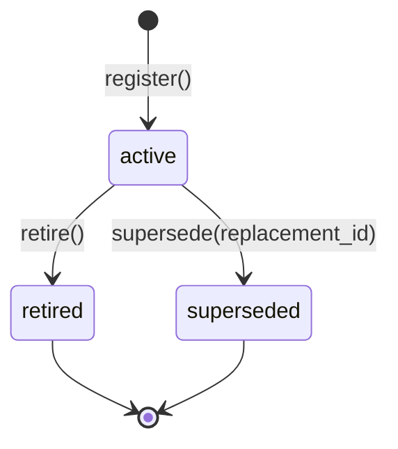
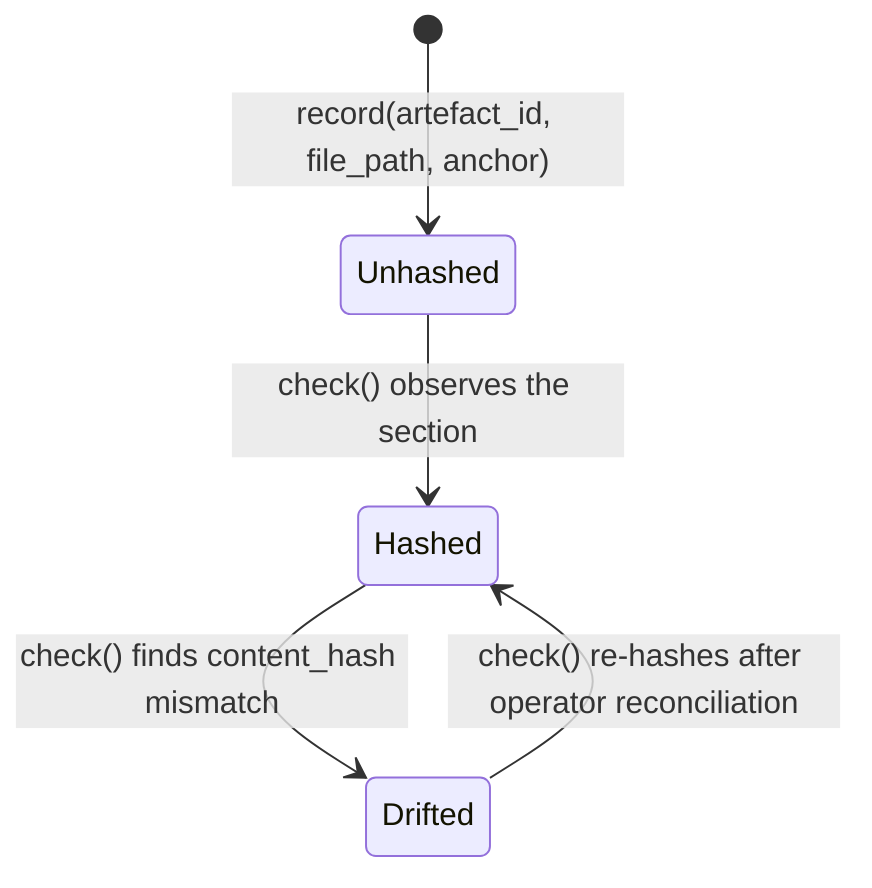
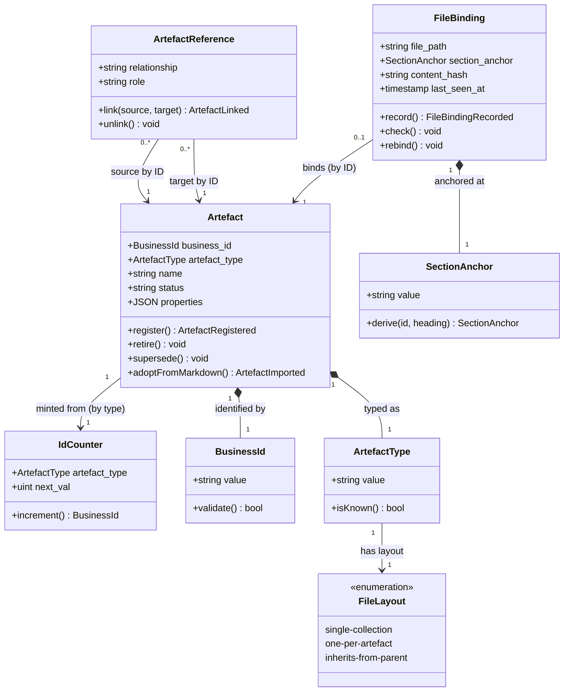

<!-- dm-version: 1.0 | bc: BC-01 | bc-name: Artefact Store | created: 2026-05-25 -->

# Domain Model — BC-01 Artefact Store

**Bounded context:** [BC-01 Artefact Store](../02b-bounded-contexts.md#bc-01--artefact-store)
**Subdomain type:** Core — clew's competitive differentiator; the integrity guarantee lives here ([rationale](../02b-bounded-contexts.md#bc-01--artefact-store))
**Ubiquitous language:** [Glossary — BC-01 Artefact Store](../02c-glossary.md#bc-01-artefact-store) — 15 terms (GT-01 through GT-15); every entity, VO, and event name in this model is reconciled to its glossary term in the per-section "Glossary term" field below

> "An aggregate is a cluster of associated objects that we treat as a unit for the purpose of data changes. Each aggregate has a root and a boundary." — Evans, *Domain-Driven Design* (2003), Chapter 8

---

## Aggregate catalogue

| ID | Name | Root entity | Member entities | Member VOs | Invariant count | Domain events |
|---|---|---|---|---|---|---|
| BC-01.AGG-01 | Artefact | `Artefact` · BC-01.ENT-01 | (none — root only) | `BusinessId`, `ArtefactType`, `IdCounter` | 3 | `ArtefactRegistered`, `ArtefactImported`, `SnapshotExported`, `SnapshotRestored` |
| BC-01.AGG-02 | ArtefactReference | `ArtefactReference` · BC-01.ENT-02 | (none — root only) | (none) | 3 | `ArtefactLinked` |
| BC-01.AGG-03 | FileBinding | `FileBinding` · BC-01.ENT-03 | (none — root only) | `SectionAnchor`, `FileLayout` | 2 | `FileBindingRecorded` |

---

## Aggregates

### Artefact · BC-01.AGG-01

**Root:** `Artefact` (BC-01.ENT-01)
**Responsibility:** maintains a unique, immutable business identity for every named record in the metamodel and governs its one-way status lifecycle.

**Invariants:**
- **INV-1:** A registered artefact's `business_id` is unique across the artefact store and is immutable after registration.
- **INV-2:** A registered artefact's `artefact_type` is immutable; changing what kind of thing an artefact is requires creating a new artefact, not mutating the existing one.
- **INV-3:** Status transitions are one-way: `active → retired` or `active → superseded`. A retired or superseded artefact cannot return to `active`.

**Lifecycle states:**



**Commands → Events:**

| Command | Precondition | Domain Event |
|---|---|---|
| `register(type, name, file?)` | `business_id` not already taken for this type | `ArtefactRegistered` (BC-01.EVT-01) |
| `adoptFromMarkdown(file)` | heading first-token matches a known business-ID pattern | `ArtefactImported` (BC-01.EVT-02) |
| `retire()` | `status = active` | `ArtefactRetired` *(folded into the status transition; no separate event in v1)* |
| `supersede(replacement_id)` | `status = active` and `replacement_id` exists | `ArtefactSuperseded` *(folded into the status transition; no separate event in v1)* |
| `exportSnapshot(dest)` | (collection-level — see Domain Service note below) | `SnapshotExported` (BC-01.EVT-04) |
| `importSnapshot(src)` | (collection-level — destructive overwrite) | `SnapshotRestored` (BC-01.EVT-05) |

> **Domain service note:** `SnapshotExported` and `SnapshotRestored` operate on the whole `artefacts` collection, not on a single root instance. They are modelled here on AGG-01 because the collection has no separate aggregate of its own; in code they will be implemented as an application-service method that iterates the collection, not as `Artefact.export()`.

**Member entities:** root only — `Artefact` (BC-01.ENT-01)
**Member value objects:** `BusinessId`, `ArtefactType`, `IdCounter` (see [§Value object catalogue](#value-object-catalogue))

**Consistency boundary rationale:** the business-ID counter (`IdCounter`) and the artefact record are mutated atomically in the same transaction so that two concurrent `register()` calls cannot mint the same `business_id`. Properties (typed per artefact_type) live inside the root's JSON payload because they are validated only against the artefact as a whole — there is no cross-artefact invariant that requires them to live outside the root.

**Size check:** 1 entity ≤ 5 ✅

---

### ArtefactReference · BC-01.AGG-02

**Root:** `ArtefactReference` (BC-01.ENT-02)
**Responsibility:** maintains a typed, directed edge between two artefacts with optional role annotation, enforcing that every recorded relationship satisfies the registered type-safety rules.

**Invariants:**
- **INV-1:** Source artefact ≠ target artefact (no self-reference).
- **INV-2:** `relationship` must exist in the allowed-relationships registry (see [§Relationship registry](#relationship-registry)). Unknown relationship labels are rejected at write time.
- **INV-3:** The `artefact_type` of source and target must satisfy the registry's type constraints for `relationship`. A `TRIGGERS` edge whose source is a capability (not a persona) is rejected.

**Lifecycle states:** none — references are immutable once written; "remove a relationship" means deleting the row, not transitioning it.

**Commands → Events:**

| Command | Precondition | Domain Event |
|---|---|---|
| `link(source, relationship, target, role?)` | all 3 INVs satisfied | `ArtefactLinked` (BC-01.EVT-03) |
| `unlink(source, relationship, target)` | edge exists | (no event in v1 — recorded in audit trail only) |

**Member entities:** root only — `ArtefactReference` (BC-01.ENT-02)
**Member value objects:** (none — relationship is a string from the registry; role is free text or registry-constrained)

**Consistency boundary rationale:** an edge is a self-contained fact between two artefacts; it has no internal state beyond its three identity columns + role. Modelling it as a separate aggregate (rather than a property on `Artefact`) allows edges to be added, removed, or re-annotated without touching either endpoint artefact, and lets `clew impact` / `clew trace` traverse the edge graph without loading endpoint property payloads.

**Size check:** 1 entity ≤ 5 ✅

---

### FileBinding · BC-01.AGG-03

**Root:** `FileBinding` (BC-01.ENT-03)
**Responsibility:** maintains the link between one artefact record and the markdown file section where its narrative lives, enabling `clew where <id>` and drift detection.

**Invariants:**
- **INV-1:** At most one binding per artefact. An artefact's narrative lives in exactly one file section.
- **INV-2:** The `(file_path, section_anchor)` pair is unique across all bindings — two artefacts cannot share the same section in the same file.

**Lifecycle states:**



**Commands → Events:**

| Command | Precondition | Domain Event |
|---|---|---|
| `record(artefact_id, file_path, section_anchor)` | artefact exists; `(file_path, section_anchor)` not already bound | `FileBindingRecorded` (BC-01.EVT-06) |
| `check()` | binding exists | (no event in v1; `clew check` emits a drift report) |

**Member entities:** root only — `FileBinding` (BC-01.ENT-03)
**Member value objects:** `SectionAnchor`, `FileLayout` (see [§Value object catalogue](#value-object-catalogue))

**Consistency boundary rationale:** bindings are file-system concerns, not identity concerns. An artefact can exist in the store before its narrative has been written (content_hash is `NULL` until `clew check` first visits the section). Separating the binding from the artefact root lets the markdown layer evolve (rename a file, restructure a heading) without invalidating the artefact's identity.

**Size check:** 1 entity ≤ 5 ✅

---

## Entity catalogue

### Artefact · BC-01.ENT-01

**Glossary term:** [Artefact · BC-01.GT-01](../02c-glossary.md#artefact--bc-01gt-01)
**Aggregate:** BC-01.AGG-01 (Artefact)

**Identity:** `business_id` (e.g. `P-01`, `C1.2`, `OBJ-03`) — assigned at registration by the application from the `id_sequences` counter for the artefact type; immutable thereafter.

**Key attributes** (domain-meaningful only):

| Attribute | Type | Business meaning |
|---|---|---|
| `business_id` | `BusinessId` (VO) | The stable semantic key agents write in markdown prose; survives DB drop-and-restore cycles |
| `artefact_type` | `ArtefactType` (VO) | What kind of thing this is (persona, capability, epic, …); determines property schema and ID format |
| `name` | string | Human-readable label for the artefact; appears in CLI listings and traceability views |
| `status` | enum `active` \| `retired` \| `superseded` | Lifecycle state; gates which commands are permitted |
| `properties` | JSON | Type-specific payload validated by the Pydantic model for `artefact_type` before write |

**Behaviour methods:**

| Method | Parameters | What it does + invariant enforced |
|---|---|---|
| `register()` | `(type, name, file?)` | Mints `business_id` from `id_sequences`, validates `properties` against type schema, writes the artefact and (if `file` provided) the FileBinding in one transaction; raises `ArtefactRegistered`. Enforces INV-1 + INV-2. |
| `retire()` | () | Sets `status = retired`; rejects if INV-3 is violated. |
| `supersede(replacement_id)` | (id of the replacing artefact) | Sets `status = superseded`; verifies the replacement artefact exists; rejects if INV-3 is violated. |
| `adoptFromMarkdown(file_path)` | (path) | Class-level operation: scans the file for ID-shaped headings, calls `register()` for each unseen ID without re-minting (uses the parsed ID), advances `id_sequences.next_val` to `max(suffix) + 1`. Raises `ArtefactImported` per heading. |

**Lifecycle:** Created on `clew new` or `clew import md` → mutated only via `retire()` / `supersede()` → never deleted (audit trail intact).

---

### ArtefactReference · BC-01.ENT-02

**Glossary term:** [Relationship · BC-01.GT-06](../02c-glossary.md#relationship--bc-01gt-06) — *note: the glossary term is "Relationship" but the class name is `ArtefactReference`; deliberate divergence to avoid ORM/SQL reserved-word collisions, documented in the glossary entry's code-convention note*
**Aggregate:** BC-01.AGG-02 (ArtefactReference)

**Identity:** the triple `(source_business_id, relationship, target_business_id)` is the logical key; a surrogate `pk` exists for efficient joins but bears no business meaning.

**Key attributes** (domain-meaningful only):

| Attribute | Type | Business meaning |
|---|---|---|
| `source` | reference to `Artefact` by business ID | The artefact at the tail of the directed edge |
| `relationship` | string from registry | The typed semantic of the edge (TRIGGERS, CONSUMES, GROUPS, …) |
| `target` | reference to `Artefact` by business ID | The artefact at the head of the directed edge |
| `role` | string (optional, registry-constrained per relationship) | Metadata about how source uses target (e.g. `Differentiator`, `Necessary` on a CONSUMES edge) |

**Behaviour methods:**

| Method | Parameters | What it does + invariant enforced |
|---|---|---|
| `link()` | `(source, relationship, target, role?)` | Resolves both endpoints, checks registry membership and type-safety, writes the edge; raises `ArtefactLinked`. Enforces INV-1, INV-2, INV-3. |
| `unlink()` | (matching triple) | Removes the edge; recorded in audit trail. |

**Lifecycle:** Created on `clew link` → immutable while present → deleted by `clew unlink` (no soft-delete; the audit trail is the history).

---

### FileBinding · BC-01.ENT-03

**Glossary term:** [File binding · BC-01.GT-07](../02c-glossary.md#file-binding--bc-01gt-07)
**Aggregate:** BC-01.AGG-03 (FileBinding)

**Identity:** `artefact_id` — one binding per artefact; the binding's identity is borrowed from the artefact it binds.

**Key attributes** (domain-meaningful only):

| Attribute | Type | Business meaning |
|---|---|---|
| `artefact` | reference to `Artefact` by business ID | The artefact whose narrative this binding locates |
| `file_path` | string (relative repo path) | Where the narrative lives on disk |
| `section_anchor` | `SectionAnchor` (VO) | The GFM autoanchor within `file_path` that scopes the artefact's narrative |
| `content_hash` | string \| null | Hash of the section content at last `check()`; null until first observation |
| `last_seen_at` | timestamp \| null | When `check()` last successfully observed the section; null until first observation |

**Behaviour methods:**

| Method | Parameters | What it does + invariant enforced |
|---|---|---|
| `record()` | `(artefact_id, file_path, section_anchor)` | Verifies the artefact exists and the `(file_path, section_anchor)` pair is unused; writes the binding with `content_hash = NULL`; raises `FileBindingRecorded`. Enforces INV-1, INV-2. |
| `check()` | () | Re-reads the file section, computes its content hash, updates `content_hash` + `last_seen_at`; if the new hash differs from the stored one, surfaces a drift report. |
| `rebind()` | `(new_file_path?, new_section_anchor?)` | Operator-driven move of the narrative; preserves INV-1 + INV-2 against the new location. |

**Lifecycle:** Created on `clew new --file …` or `clew import md` → mutated by `check()` (hash + timestamp) and `rebind()` → deleted only when its artefact is hard-removed (rare).

---

## Value object catalogue

### BusinessId · BC-01.VO-01

**Glossary term:** [Business ID · BC-01.GT-03](../02c-glossary.md#business-id--bc-01gt-03)
**Used by:** AGG-01 (Artefact), AGG-02 (ArtefactReference for source/target), AGG-03 (FileBinding for artefact)

**Attributes** (all immutable):
- `value`: string — the formatted business ID (e.g. `P-01`, `C1.2.F03`, `KR-02.3`)

**Equality:** equal when `value` strings are identical (case-sensitive).

**Validation invariants** (enforced at construction):
- Format must match the per-type pattern (e.g. `P-\d{2}`, `OBJ-\d{2}`, `KR-\d+\.\d+`, `ADR-\d{4}`); see [§Business identity](#business-identity) for the full table.
- Never null or empty.

**Replace-not-mutate:** confirmed.

---

### SectionAnchor · BC-01.VO-02

**Glossary term:** [Section anchor · BC-01.GT-08](../02c-glossary.md#section-anchor--bc-01gt-08)
**Used by:** AGG-03 (FileBinding)

**Attributes** (all immutable):
- `value`: string — the GFM-compatible anchor (`{lowercase_id}--{gfm_slug_of_heading}`)

**Equality:** equal when `value` strings are identical.

**Validation invariants** (enforced at construction):
- Format: `{lowercase_id}--{slug}` where the slug matches GFM autoanchor rules (lowercase ASCII letters, digits, hyphens; spaces → hyphens; non-ASCII stripped).
- Computable deterministically from `(business_id, heading_text)` so two clients produce the same anchor for the same input.

**Replace-not-mutate:** confirmed — once set at `record()` time, anchor changes flow through `rebind()`, which constructs a new instance rather than mutating the stored one.

**Derivation:**

```
SectionAnchor.derive(business_id, heading_text) →
  f"{business_id.lower()}--{gfm_slug(heading_text)}"
```

Example: `P-01` + heading "P-01 · Ava the agent-first product engineer" → `p-01--ava-the-agent-first-product-engineer`.

---

### ArtefactType · BC-01.VO-03

**Glossary term:** [Artefact type · BC-01.GT-02](../02c-glossary.md#artefact-type--bc-01gt-02)
**Used by:** AGG-01 (Artefact)

**Attributes** (all immutable):
- `value`: string — one of the registered types (`persona`, `capability`, `value_stream`, `vs_stage`, `objective`, `key_result`, `fbs_functionality`, `epic`, `adr`, …)

**Equality:** equal when `value` strings are identical.

**Validation invariants** (enforced at construction):
- Must be a key in `ARTEFACT_TYPE_CONFIGS` (defined in `schema.py`); unknown types are rejected.

**Replace-not-mutate:** confirmed.

---

### FileLayout · BC-01.VO-04

**Glossary term:** [Layout · BC-01.GT-09](../02c-glossary.md#layout--bc-01gt-09) — *note: the glossary term is the bare "Layout" but the class name is kept as `FileLayout` for code clarity; documented in the glossary entry's code-convention note*
**Used by:** AGG-03 (FileBinding — indirectly via `ARTEFACT_TYPE_CONFIGS`)

**Attributes** (all immutable):
- `value`: enum literal — one of `single-collection`, `one-per-artefact`, `inherits-from-parent`

**Equality:** literal equality.

**Validation invariants** (enforced at construction):
- Must be one of the three enum values; the set is fixed at v0.1 per [ADR-0002](../../architecture/decisions/adr-0002-artefact-file-binding.md).

**Replace-not-mutate:** confirmed — this is a static metadata constant per artefact type, not per-instance state.

---

### IdCounter · BC-01.VO-05

**Glossary term:** sub-concept of [Business ID · BC-01.GT-03](../02c-glossary.md#business-id--bc-01gt-03) — *not a top-level glossary term; the application-managed counter that mints the next Business ID is documented in GT-03's code-convention note rather than as its own entry*
**Used by:** AGG-01 (Artefact — referenced by `register()` to mint the next `BusinessId`)

**Attributes** (all immutable per snapshot):
- `artefact_type`: `ArtefactType` — the type this counter is scoped to
- `next_val`: positive integer — the next suffix to assign

**Equality:** equal when both `artefact_type` and `next_val` are equal.

**Validation invariants** (enforced at construction):
- `next_val ≥ 1`
- `artefact_type` must match a registered artefact type.

**Replace-not-mutate:** confirmed — on each ID generation, the counter is replaced (not mutated) via an atomic `UPDATE … RETURNING` that increments `next_val` and returns the previous value in one statement. The previous instance is discarded.

---

## Domain event catalogue

### ArtefactRegistered · BC-01.EVT-01

**Naming check:** past tense ✅ | business-meaningful ✅
**Raised by aggregate:** BC-01.AGG-01 (Artefact)

**Trigger:** `clew new <type> <name>` succeeds.

**Payload:**

| Field | Type | Why consumers need this |
|---|---|---|
| `business_id` | string | Stable key the consumer will reference downstream |
| `artefact_type` | string | Lets consumers filter by what kind of artefact was created |
| `name` | string | Human-readable label for traceability views |
| `file_path` | string \| null | Where the narrative will live (if `--file` was provided) |
| `created_at` | timestamp | When this happened (for audit replay) |

**Consumers:**
- CLI (prints `business_id` to stdout)
- marimo notebooks (query `artefacts` after the event)

**Business significance:** a new named record exists in the metamodel with a stable, collision-free ID that all downstream artefacts can safely reference. This is the precondition for every cross-artefact relationship.

---

### ArtefactImported · BC-01.EVT-02

**Naming check:** past tense ✅ | business-meaningful ✅
**Raised by aggregate:** BC-01.AGG-01 (Artefact)

**Trigger:** `clew import md <path>` processes a heading whose first token matches a known business ID pattern.

**Payload:**

| Field | Type | Why consumers need this |
|---|---|---|
| `business_id` | string | The ID parsed from the heading |
| `artefact_type` | string | Inferred from the ID pattern |
| `name` | string | Heading text minus the ID prefix |
| `file_path` | string | Where the imported artefact lives |
| `section_anchor` | string | The GFM autoanchor of the heading |

**Consumers:**
- CLI (reports adoptions vs. orphans)
- `clew check` (uses the binding to detect future drift)

**Business significance:** a pre-existing markdown artefact (authored before clew) has been adopted into the store; the `id_sequences` counter has been advanced past its suffix to prevent future collisions. This is how brownfield repos migrate without manual ID re-minting.

---

### ArtefactLinked · BC-01.EVT-03

**Naming check:** past tense ✅ | business-meaningful ✅
**Raised by aggregate:** BC-01.AGG-02 (ArtefactReference)

**Trigger:** `clew link <source-id> <relationship> <target-id>` succeeds.

**Payload:**

| Field | Type | Why consumers need this |
|---|---|---|
| `source_business_id` | string | Tail of the edge |
| `relationship` | string | Registry label (TRIGGERS, CONSUMES, …) |
| `target_business_id` | string | Head of the edge |
| `role` | string \| null | Edge-metadata annotation (e.g. `Differentiator`) |

**Consumers:**
- CLI (prints confirmation)
- `clew matrix` / `clew trace` / `clew impact` (the new edge appears in next query)
- `clew estimate` (rolls up effort along GROUPS edges)

**Business significance:** a semantic dependency between two metamodel artefacts is now queryable; traceability views will include this edge. This is the mechanism by which the metamodel becomes a graph.

---

### SnapshotExported · BC-01.EVT-04

**Naming check:** past tense ✅ | business-meaningful ✅
**Raised by aggregate:** BC-01.AGG-01 (Artefact) — collection-level (see Domain service note in §AGG-01)

**Trigger:** `clew export [--out snapshot/]` completes.

**Payload:**

| Field | Type | Why consumers need this |
|---|---|---|
| `destination_path` | string | Where the snapshot was written |
| `record_counts_per_type` | map<type, int> | What was captured (for verification + audit) |
| `timestamp` | timestamp | When the snapshot was taken |

**Consumers:**
- git (the snapshot directory becomes the next commit's diff)
- `clew import snapshot` (the inverse operation, on a different machine or after a DB drop)

**Business significance:** the current store state is now persisted in a business-ID-centric YAML format that is git-trackable, human-readable, and sufficient for a full DB restore. This is the durability mechanism that makes the SQLite file disposable.

---

### SnapshotRestored · BC-01.EVT-05

**Naming check:** past tense ✅ | business-meaningful ✅
**Raised by aggregate:** BC-01.AGG-01 (Artefact) — collection-level (see Domain service note in §AGG-01)

**Trigger:** `clew import snapshot [--from snapshot/]` completes.

**Payload:**

| Field | Type | Why consumers need this |
|---|---|---|
| `source_path` | string | Where the snapshot was read from |
| `record_counts_restored_per_type` | map<type, int> | What was rehydrated |
| `surrogate_pk_remapping_stats` | object | How many references were re-resolved to new surrogate PKs |

**Consumers:**
- CLI (prints restore summary)
- all subsequent `clew` commands (now operate on the restored state)

**Business significance:** the store has been rebuilt from the snapshot; all business IDs are identical to the exported state; surrogate PKs have been regenerated and all FK references re-resolved. This proves the snapshot is the true source of truth, not the binary `.db` file.

---

### FileBindingRecorded · BC-01.EVT-06

**Naming check:** past tense ✅ | business-meaningful ✅
**Raised by aggregate:** BC-01.AGG-03 (FileBinding)

**Trigger:** `clew new <type> --file <path> …` succeeds, or `clew import md` processes a matching heading.

**Payload:**

| Field | Type | Why consumers need this |
|---|---|---|
| `business_id` | string | Which artefact this binding belongs to |
| `file_path` | string | Where the narrative will live |
| `section_anchor` | string | The GFM anchor scoping the artefact's narrative |
| `content_hash` | string \| null | Hash at recording time (null on initial record; populated on first `check()`) |

**Consumers:**
- CLI (`clew where <id>` can now return a navigable `file#anchor` link)
- `clew check` (drift detection has an anchor to verify against)

**Business significance:** the agent knows where to write the narrative section, and any future reader can navigate from a query result row to its prose with one click. This is the mechanism that keeps the structured store and the narrative layer reconciled.

---

## Class diagram



---

## Relationship registry

Canonical relationship types enforced at write time by `crud.py`. New types are added to the registry in code — no DDL migration required.

| Relationship | Source type(s) | Target type(s) | Role values | Notes |
|---|---|---|---|---|
| `TRIGGERS` | `persona` | `value_stream` | — | A persona triggers a value stream |
| `CONSUMES` | `vs_stage` | `capability` | `Differentiator`, `Necessary` | A VS stage consumes a capability |
| `REALIZES` | `fbs_functionality` | `vs_stage` | `Differentiator` | A functionality realises a VS stage |
| `GROUPS` | `epic` | `fbs_functionality` | — | An epic groups FBS functionalities |
| `INFORMS` | `objective` | `vs_stage` | — | An objective informs a VS stage |
| `REFERENCES` | any | any | (free text) | Generic soft cross-link; no type constraint |

Source and target `artefact_type` values are validated against this registry before any `artefact_references` row is written. A mismatch produces a structured error naming the relationship, the actual types, and the allowed types.

---

## Business identity

Business identifiers are **generated exclusively by the application layer** from the `id_sequences` counter — never by the DB engine and never by an LLM. The `id_sequences` table is included in the YAML snapshot so counters are reproduced identically on restore.

**ID format per artefact type:**

| Artefact type | Format | Example |
|---|---|---|
| `persona` | `P-{nn}` | `P-01` |
| `capability` | `C{n}.{m}` | `C1.2` |
| `epic` | `E-{nn}` | `E-NN` |
| `objective` | `OBJ-{nn}` | `OBJ-02` |
| `key_result` | `KR-{parent_id}.{m}` | `KR-02.3` |
| `vs_stage` | `{parent_id}.{m}` | `VS-1.3` |
| `fbs_functionality` | `{parent_id}.F{nn}` | `C1.2.F03` |
| `adr` | `ADR-{nnnn}` | `ADR-0004` |
| `glossary_term` | `BC-{nn}.GT-{nn}` | `BC-01.GT-05` |

**Generation contract:** `next_business_id(conn, artefact_type, parent_business_id?)` — atomically increments `id_sequences.next_val` for the type and returns the formatted ID. The increment and the artefact insert are in the same SQLite transaction; partial writes are not possible.

**Snapshot contract:** `clew export` serialises the `id_sequences` table alongside all artefact records. `clew import snapshot` writes artefacts with their existing `business_id` values; it then sets `id_sequences.next_val` to `max(suffix) + 1` for each type from the imported records, ensuring no future collision.

---

# Implementation supplement

The sections below are **intentional deviations from the `domain-model` skill template**. They are kept in this file by [ADR-0003 §Dependent artefacts](../../architecture/decisions/adr-0003-schema-design-typed-property-graph.md), which assigns the physical DDL location to the BC-01 domain model file rather than a separate interface contract. They describe the *implementation* of the domain model above (the *what*), distinct from the conceptual model (the *why*). If/when a separate `docs/architecture/data-model/artefact-store-schema.md` is introduced, this section moves there and this file becomes template-pure.

## Physical schema

The SQLite physical schema implementing this domain model.

```sql
-- Per-connection PRAGMAs (set in the CLI's connection factory, not in DDL)
--   PRAGMA foreign_keys = ON;     -- enforce FK constraints (SQLite default is OFF)
--   PRAGMA journal_mode = WAL;    -- single-writer + non-blocking readers
--   PRAGMA synchronous = NORMAL;  -- safe with WAL; faster than FULL

-- Surrogate keys via INTEGER PRIMARY KEY AUTOINCREMENT (SQLite rowid alias).
-- Surrogate PKs are intentionally regenerated on DB recreation; only business_id is stable.

-- Business ID counter (application-managed; included in YAML snapshot)
CREATE TABLE id_sequences (
  artefact_type  TEXT     PRIMARY KEY,
  next_val       INTEGER  NOT NULL DEFAULT 1 CHECK (next_val >= 1)
);

-- Universal artefact table — maps to BC-01.AGG-01
CREATE TABLE artefacts (
  pk             INTEGER  PRIMARY KEY AUTOINCREMENT,
  business_id    TEXT     UNIQUE NOT NULL,           -- stable semantic key; never regenerated
  artefact_type  TEXT     NOT NULL,
  name           TEXT     NOT NULL,
  status         TEXT     NOT NULL DEFAULT 'active'  -- active | retired | superseded
                          CHECK (status IN ('active','retired','superseded')),
  created_at     TEXT     NOT NULL DEFAULT (datetime('now')),  -- ISO-8601 UTC
  properties     TEXT     NOT NULL DEFAULT '{}'      -- JSON blob; validated by Pydantic
                          CHECK (json_valid(properties))
);

CREATE INDEX idx_artefacts_type ON artefacts(artefact_type);

-- Typed edge table — maps to BC-01.AGG-02
CREATE TABLE artefact_references (
  pk            INTEGER  PRIMARY KEY AUTOINCREMENT,
  source_pk     INTEGER  NOT NULL REFERENCES artefacts(pk),
  relationship  TEXT     NOT NULL,
  target_pk     INTEGER  NOT NULL REFERENCES artefacts(pk),
  role          TEXT,
  created_at    TEXT     NOT NULL DEFAULT (datetime('now')),
  CHECK (source_pk <> target_pk)
);

CREATE INDEX idx_refs_source ON artefact_references(source_pk, relationship);
CREATE INDEX idx_refs_target ON artefact_references(target_pk, relationship);

-- File binding table — maps to BC-01.AGG-03
CREATE TABLE file_bindings (
  pk             INTEGER  PRIMARY KEY AUTOINCREMENT,
  artefact_pk    INTEGER  NOT NULL REFERENCES artefacts(pk),
  file_path      TEXT     NOT NULL,
  section_anchor TEXT     NOT NULL,
  content_hash   TEXT,                                -- NULL until clew check first hashes the section
  last_seen_at   TEXT,                                -- NULL until clew check first visits the section
  UNIQUE (artefact_pk),                               -- one binding per artefact
  UNIQUE (file_path, section_anchor)                  -- no two artefacts share a file section
);

CREATE INDEX idx_bindings_file ON file_bindings(file_path);
```

## Property schemas

Type-specific fields are stored in `artefacts.properties` (a JSON text blob validated by SQLite's `json_valid()` at write time) and validated by Pydantic models in `schema.py` before write. Examples of representative types:

| Artefact type | Key properties | Notes |
|---|---|---|
| `persona` | `goals`, `pain_points`, `role` | Free-text strings |
| `capability` | `strategic_importance` (`Differentiator`/`Necessary`/`Commodity`), `definition`, `outcomes` | `strategic_importance` validated against enum |
| `fbs_functionality` | `description`, `vs_stage` (soft-link), `is_differentiator` (bool), `status` (`planned`/`in-progress`/`done`), `complexity` (`XS`/`S`/`M`/`L`/`XL`) | `vs_stage` is a business ID reference, not a FK |
| `epic` | `phase`, `value_statement` | `phase` is a positive integer |
| `objective` | `perspective` (BSC tag), `timeframe`, `owner` | `perspective`: `financial`/`customer`/`internal`/`learning` |
| `key_result` | `metric`, `baseline`, `target`, `unit`, `measurement_method` | `target` is numeric |

## Graph traversal pattern

All `clew impact`, `clew trace`, and `clew matrix` queries use a single recursive CTE pattern over `artefact_references`. Surrogate PKs are used internally for joins; only business IDs appear in query output.

Maximum traversal depth in the clew metamodel is bounded at 5 hops (persona → value stream → FBS functionality → epic → PRD). A depth guard of 10 provides safety without constraining real queries.

```sql
WITH RECURSIVE impact(pk, business_id, artefact_type, relationship, depth) AS (
  SELECT a.pk, a.business_id, a.artefact_type, r.relationship, 1
  FROM   artefact_references r
  JOIN   artefacts a ON a.pk = r.source_pk
  WHERE  r.target_pk = (SELECT pk FROM artefacts WHERE business_id = ?)
  UNION ALL
  SELECT a.pk, a.business_id, a.artefact_type, r.relationship, i.depth + 1
  FROM   artefact_references r
  JOIN   artefacts a ON a.pk = r.source_pk
  JOIN   impact i    ON r.target_pk = i.pk
  WHERE  i.depth < 10
)
SELECT business_id, artefact_type, relationship, depth FROM impact ORDER BY depth;
```

---

## Open Items

| OI-ID  | Type           | Summary                                                                                                                                                | Source anchor                | Source heading                                | Resolution path                                                                                                                       | Priority | Status | Owner   | Due / Review date | Tracker ref |
| :----- | :------------- | :----------------------------------------------------------------------------------------------------------------------------------------------------- | :--------------------------- | :-------------------------------------------- | :------------------------------------------------------------------------------------------------------------------------------------ | :------- | :----- | :------ | :---------------- | :---------- |
| OI-0019 | doc-gap        | Glossary `docs/domain/02c-glossary.md` does not exist; every entity / VO / event in this model carries `_TODO_ — BC-01.GT-NN` for its glossary-term link. | #ubiquitous-language         | Domain Model — BC-01 Artefact Store (header)  | Run the `domain-glossary` skill against BC-01 to seed `GT-NN` terms (artefact, business ID, relationship, file binding, snapshot, …); then replace every `_TODO_ — BC-01.GT-NN` placeholder in this file with the actual term ID. | high     | closed | victor  | 2026-05-25        | 2026-05-25 commit on main — glossary authored with 15 BC-01 terms in commit `8cea266`; every entity (3) + VO (5) Glossary-term placeholder in this file replaced with live `02c-glossary.md#{term}--bc-01gt-{nn}` links in the same pass; header Ubiquitous language line points at the glossary's BC-01 section |
| OI-0020 | decision-gap   | Whether the Implementation supplement (Physical schema / Property schemas / Graph traversal pattern) stays in this file or moves to a separate data-model contract document. ADR-0003 currently sanctions it being here. | #implementation-supplement   | Implementation supplement                     | Decide once a second domain model file is created and the duplication / divergence cost becomes visible; if it moves, update ADR-0003 §Dependent artefacts to point at the new location. | low      | open   | victor  | 2026-09-01        | _TBD_       |

---

## Changelog

| Date | Author | Change |
|---|---|---|
| 2026-05-25 | Victor Hueni | Initial draft drawn from ADR-0001 + ADR-0002 + ADR-0003 (under DuckDB). |
| 2026-05-25 | Victor Hueni | SQLite cascade: DDL rewritten for SQLite syntax (INTEGER PK AUTOINCREMENT, `datetime('now')`, `json_valid()` CHECK); PRAGMAs documented; transaction reference updated. |
| 2026-05-25 | Victor Hueni | Template alignment pass (`domain-model` skill v1.0): H1 reformatted, Subdomain type + Ubiquitous language headers added, aggregate catalogue columns aligned to template, per-aggregate Commands → Events tables + Size check lines + Member listings added, dedicated Entity catalogue + Value object catalogue + Domain event catalogue sections introduced (entity sections now document behaviour methods explicitly to fix anemic-model finding), AGG-02 invariant rephrased to business language (`source ≠ target`), Implementation supplement clearly demarcated per ADR-0003 deviation, Open Items populated with glossary + supplement-location items, Changelog added. |
| 2026-05-25 | Victor Hueni | Glossary cross-reference pass 2 (closes OI-0019): header `Ubiquitous language` line now points at [`../02c-glossary.md#bc-01-artefact-store`](../02c-glossary.md#bc-01-artefact-store); every entity Glossary-term field (3) and every value-object Glossary-term field (5) wired to live `02c-glossary.md#{term}--bc-01gt-{nn}` anchors. Two deliberate class-name ↔ glossary-term divergences flagged inline (`ArtefactReference` class for the `Relationship` term — ORM/SQL reserved-word safety; `FileLayout` class for the `Layout` term — code clarity), both referencing the glossary's code-convention notes. `IdCounter` (VO-05) annotated as a sub-concept of `Business ID · GT-03` since it is the mint mechanism, not a standalone domain concept. OI-0019 closed with tracker-ref text identifying commit `8cea266` (glossary authoring) and this commit (07b cross-reference wiring). |
