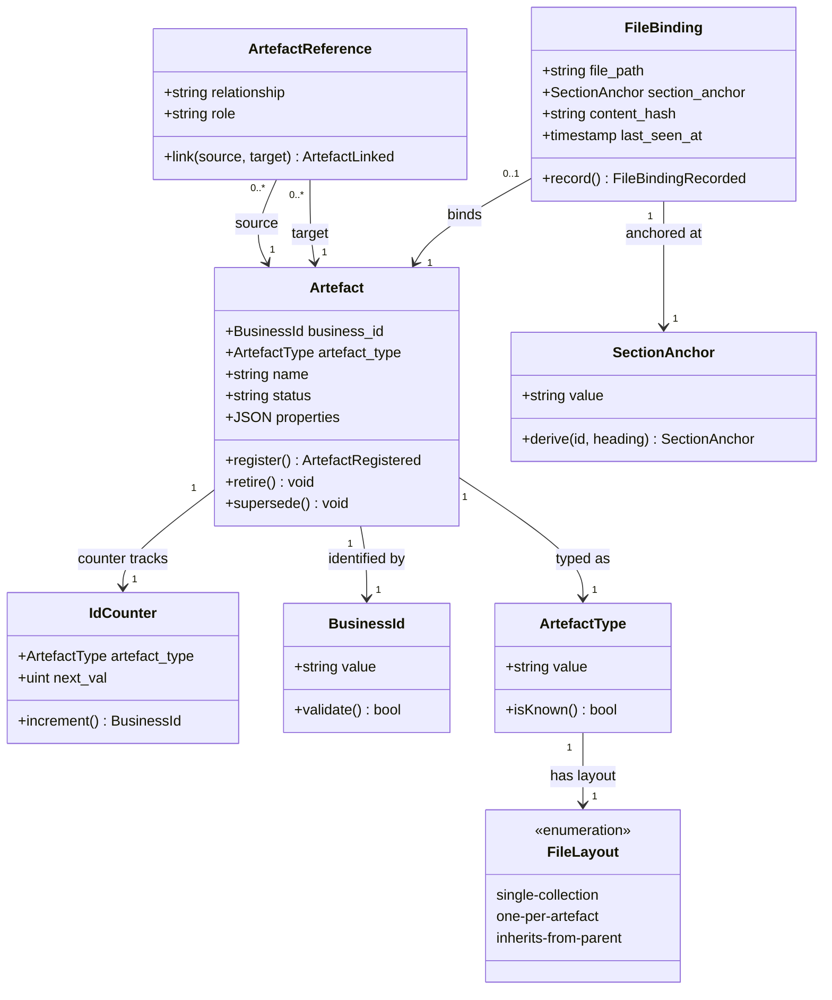

# Artefact Store — Domain Model

Bounded context: [BC-01 Artefact Store](../02b-bounded-contexts.md)

## Aggregate catalogue

| AGG-ID | Root entity | Invariants | Member count | Status |
|---|---|---|---|---|
| BC-01.AGG-01 | `Artefact` | business_id unique + immutable; artefact_type immutable; status transitions bounded | 1 root + `IdCounter` VO | active |
| BC-01.AGG-02 | `ArtefactReference` | source ≠ target; relationship type in registry; source + target types satisfy registry constraints | 1 root | active |
| BC-01.AGG-03 | `FileBinding` | at most one binding per artefact; file_path + section_anchor pair unique across all bindings | 1 root | active |

---

## BC-01.AGG-01 — Artefact

### Root definition

An `Artefact` is any named, typed record in the metamodel — a persona, capability,
value-stream stage, FBS functionality, epic, ADR, etc. It is the universal node in the
artefact graph.

### Invariants

1. `business_id` is unique across all artefacts and is immutable after the record is
   created. It is assigned by the application layer (`id_gen.py`) from the `id_sequences`
   table — never by the DB engine and never by an LLM.
2. `artefact_type` is immutable after creation. Changing what kind of thing an artefact is
   requires creating a new record, not mutating the existing one.
3. `status` transitions are one-way: `active → retired` or `active → superseded`. A retired
   or superseded artefact cannot return to `active`.

### Consistency boundary rationale

Each artefact is fully self-contained in its row. Cross-artefact relationships are edges in
`ArtefactReference` (a separate aggregate) — they do not live on the artefact itself. This
allows an artefact to be created before its referencing relationships exist, and lets
relationships be added or removed without touching the artefact record.

### Value object: IdCounter

Tracks the per-type counter used to generate the next business ID. Stored in the
`id_sequences` table as `(artefact_type, next_val)`. The counter is application-managed and
included in the YAML snapshot so business IDs are reproducible on DB restore.

**Equality rule:** two `IdCounter` instances are equal if they share the same
`artefact_type` and `next_val`.

**Immutability:** `IdCounter` is replaced (not mutated) on each ID generation via an atomic
`UPDATE ... RETURNING` that increments `next_val` and returns the previous value in one
statement.

### Domain event: ArtefactRegistered

- **Trigger:** `clew new <type> <name>` succeeds
- **Payload:** `business_id`, `artefact_type`, `name`, `file_path` (if provided), `created_at`
- **Business significance:** a new named record exists in the metamodel with a stable,
  collision-free ID that all downstream artefacts can safely reference
- **Consumers:** CLI (prints `business_id` to stdout), marimo notebooks (query `artefacts`)

### Domain event: ArtefactImported

- **Trigger:** `clew import md <path>` processes a heading whose first token matches a known
  business ID pattern
- **Payload:** `business_id`, `artefact_type`, `name`, `file_path`, `section_anchor`
- **Business significance:** a pre-existing markdown artefact (authored before clew) has
  been adopted into the DB; the `id_sequences` counter has been advanced past its suffix to
  prevent future collisions
- **Consumers:** CLI (reports orphans and adoptions), `clew check`

---

## BC-01.AGG-02 — ArtefactReference

### Root definition

An `ArtefactReference` is a typed, directed edge between two artefacts. It carries a
`relationship` label (e.g. `TRIGGERS`, `CONSUMES`, `GROUPS`) and an optional `role`
annotation (e.g. `Differentiator`, `Necessary`).

### Invariants

1. `source_pk ≠ target_pk`: an artefact cannot reference itself.
2. `relationship` must exist in the allowed-relationships registry (see §Relationship
   registry below). Unknown relationship labels are rejected at write time.
3. The `artefact_type` of `source` and `target` must satisfy the type constraints for the
   relationship in the registry. A `TRIGGERS` edge whose source is a `capability` (not a
   `persona`) is rejected.

### Consistency boundary rationale

References are separate aggregates — not properties on `Artefact` — so they can be added,
removed, or annotated without touching either endpoint artefact. This also allows
`clew impact` and `clew trace` to traverse the graph without loading full artefact property
payloads.

### Domain event: ArtefactLinked

- **Trigger:** `clew link <source-id> <relationship> <target-id>` succeeds
- **Payload:** `source_business_id`, `relationship`, `target_business_id`, `role` (optional)
- **Business significance:** a semantic dependency between two metamodel artefacts is now
  queryable; `clew matrix` and `clew trace` will include this edge
- **Consumers:** CLI (prints confirmation), `clew estimate` (reads edges for rollup)

---

## BC-01.AGG-03 — FileBinding

### Root definition

A `FileBinding` links one `Artefact` record to the markdown file section where its
narrative lives. It stores the file path and a GFM-compatible section anchor.

### Invariants

1. At most one binding per artefact (enforced by `UNIQUE (artefact_pk)` on the
   `file_bindings` table). An artefact's narrative lives in exactly one file section.
2. The `(file_path, section_anchor)` pair is unique across all bindings — two artefacts
   cannot share the same section in the same file.

### Consistency boundary rationale

Bindings are separate aggregates — not properties on `Artefact` — because they are
file-system concerns, not identity concerns. An artefact can exist in the DB before its
narrative has been written (content_hash is NULL until `clew check` first visits the
section).

### Value object: SectionAnchor

Derived from `business_id` + the heading text: `{lowercase_id}--{gfm_slug_of_heading}`.

**Example:** `P-01` with heading "P-01 · Ava the agent-first product engineer" →
`p-01--ava-the-agent-first-product-engineer`.

**Equality rule:** two `SectionAnchor` instances are equal if their string values are
identical.

**Immutability:** once set at `clew new` time, the anchor is treated as stable. If the
heading is later renamed, `clew check` reports drift; the operator decides whether to
update the anchor (via `clew bind --update`) or leave the heading unchanged.

### Domain event: FileBindingRecorded

- **Trigger:** `clew new <type> --file <path> ...` succeeds, or `clew import md` processes
  a matching heading
- **Payload:** `business_id`, `file_path`, `section_anchor`, `content_hash` (NULL at
  creation)
- **Business significance:** `clew where <id>` can now return a navigable `file#anchor`
  link; the agent knows where to write the narrative section
- **Consumers:** CLI (`clew where`), `clew check` (drift detection)

---

## BC-01.AGG-01 domain events (continued)

### Domain event: SnapshotExported

- **Trigger:** `clew export [--out snapshot/]` completes
- **Payload:** destination path, record counts per type, timestamp
- **Business significance:** the current DB state is now persisted in a business-ID-centric
  YAML format that is git-trackable, human-readable, and sufficient for a full DB restore
- **Consumers:** git (snapshot/ directory), `clew import snapshot`

### Domain event: SnapshotRestored

- **Trigger:** `clew import snapshot [--from snapshot/]` completes
- **Payload:** source path, record counts restored per type, surrogate PK remapping stats
- **Business significance:** the DB has been rebuilt from the snapshot; all business IDs are
  identical to the exported state; surrogate PKs have been regenerated and all FK references
  re-resolved
- **Consumers:** CLI (prints summary), all subsequent `clew` commands (now operate on the
  restored state)

---

## Value object catalogue

| VO | Immutable? | Equality rule | Validation invariants |
|---|---|---|---|
| `BusinessId` | Yes | String equality | Format matches per-type pattern (e.g. `P-\d{2}`, `E-\d{2}`, `OBJ-\d{2}`, `KR-\d+\.\d+`); never null or empty |
| `SectionAnchor` | Yes (see above) | String equality | `{lowercase_id}--{gfm_slug}` format; no spaces; lowercase only |
| `ArtefactType` | Yes | String equality | Must be a key in `ARTEFACT_TYPE_CONFIGS`; unknown types are rejected |
| `FileLayout` | Yes | Literal equality | One of: `single-collection`, `one-per-artefact`, `inherits-from-parent` |
| `IdCounter` | Replace-not-mutate | `(artefact_type, next_val)` equality | `next_val ≥ 1`; `artefact_type` must match a known artefact type |

---

## Relationship registry

Canonical relationship types enforced at write time by `crud.py`. New types are added to
the registry in code — no DDL migration required.

| Relationship | Source type(s) | Target type(s) | Role values | Notes |
|---|---|---|---|---|
| `TRIGGERS` | `persona` | `value_stream` | — | A persona triggers a value stream |
| `CONSUMES` | `vs_stage` | `capability` | `Differentiator`, `Necessary` | A VS stage consumes a capability |
| `REALIZES` | `fbs_functionality` | `vs_stage` | `Differentiator` | A functionality realises a VS stage |
| `GROUPS` | `epic` | `fbs_functionality` | — | An epic groups FBS functionalities |
| `INFORMS` | `objective` | `vs_stage` | — | An objective informs a VS stage |
| `REFERENCES` | any | any | (free text) | Generic soft cross-link; no type constraint |

Source and target `artefact_type` values are validated against this registry before any
`artefact_references` row is written. A mismatch produces a structured error naming the
relationship, the actual types, and the allowed types.

---

## Business identity design

Business identifiers are **generated exclusively by the application layer** from the
`id_sequences` table — never by the DB engine (no DB sequences for business IDs) and never
by an LLM. The `id_sequences` table is included in the YAML snapshot so counters are
reproduced identically on DB restore.

**ID format per artefact type:**

| Artefact type | Format | Example |
|---|---|---|
| `persona` | `P-{nn}` | `P-01` |
| `capability` | `C{n}.{m}` | `C1.2` |
| `epic` | `E-{nn}` | `E-03` |
| `objective` | `OBJ-{nn}` | `OBJ-02` |
| `key_result` | `KR-{parent_id}.{m}` | `KR-02.3` |
| `vs_stage` | `{parent_id}.{m}` | `VS-1.3` |
| `fbs_functionality` | `{parent_id}.F{nn}` | `C1.2.F03` |
| `adr` | `ADR-{nnnn}` | `ADR-0004` |
| `glossary_term` | `BC-{nn}.GT-{nn}` | `BC-01.GT-05` |

**Generation contract:** `next_business_id(conn, artefact_type, parent_business_id?)` —
atomically increments `id_sequences.next_val` for the type and returns the formatted ID.
The increment and the artefact insert are in the same DuckDB transaction; partial writes
are not possible.

**Snapshot contract:** `clew export` serialises the `id_sequences` table alongside all
artefact records. `clew import snapshot` writes artefacts with their existing `business_id`
values; it then sets `id_sequences.next_val` to `max(suffix) + 1` for each type from the
imported records, ensuring no future collision.

---

## Physical schema

The DuckDB physical schema implementing this domain model. Authoritative source for DDL;
the domain model above describes the *why*, this section describes the *what*.

```sql
-- Surrogate key sequences (DB-native; intentionally reset on DB recreation)
CREATE SEQUENCE artefact_pk_seq START 1;
CREATE SEQUENCE ref_pk_seq      START 1;
CREATE SEQUENCE binding_pk_seq  START 1;

-- Business ID counter (application-managed; included in YAML snapshot)
CREATE TABLE id_sequences (
  artefact_type  VARCHAR  PRIMARY KEY,
  next_val       UINTEGER NOT NULL DEFAULT 1
);

-- Universal artefact table — maps to BC-01.AGG-01
CREATE TABLE artefacts (
  pk             UINTEGER     PRIMARY KEY DEFAULT nextval('artefact_pk_seq'),
  business_id    VARCHAR      UNIQUE NOT NULL,  -- stable semantic key; never regenerated
  artefact_type  VARCHAR      NOT NULL,
  name           VARCHAR      NOT NULL,
  status         VARCHAR      DEFAULT 'active', -- active | retired | superseded
  created_at     TIMESTAMPTZ  DEFAULT now(),
  properties     JSON         NOT NULL DEFAULT '{}'
);

-- Typed edge table — maps to BC-01.AGG-02
CREATE TABLE artefact_references (
  pk            UINTEGER     PRIMARY KEY DEFAULT nextval('ref_pk_seq'),
  source_pk     UINTEGER     NOT NULL REFERENCES artefacts(pk),
  relationship  VARCHAR      NOT NULL,
  target_pk     UINTEGER     NOT NULL REFERENCES artefacts(pk),
  role          VARCHAR,
  created_at    TIMESTAMPTZ  DEFAULT now()
);

CREATE INDEX idx_refs_source ON artefact_references(source_pk, relationship);
CREATE INDEX idx_refs_target ON artefact_references(target_pk, relationship);

-- File binding table — maps to BC-01.AGG-03
CREATE TABLE file_bindings (
  pk             UINTEGER     PRIMARY KEY DEFAULT nextval('binding_pk_seq'),
  artefact_pk    UINTEGER     NOT NULL REFERENCES artefacts(pk),
  file_path      VARCHAR      NOT NULL,
  section_anchor VARCHAR      NOT NULL,
  content_hash   VARCHAR,      -- NULL until clew check first hashes the section
  last_seen_at   TIMESTAMPTZ, -- NULL until clew check first visits the section
  UNIQUE (artefact_pk)         -- one binding per artefact
);

CREATE INDEX idx_bindings_file ON file_bindings(file_path);
```

### Property schemas

Type-specific fields are stored in `artefacts.properties` (JSON) and validated via Pydantic
models in `schema.py` before write. Examples of representative types:

| Artefact type | Key properties | Notes |
|---|---|---|
| `persona` | `goals`, `pain_points`, `role` | Free-text strings |
| `capability` | `strategic_importance` (`Differentiator`/`Necessary`/`Commodity`), `definition`, `outcomes` | `strategic_importance` validated against enum |
| `fbs_functionality` | `description`, `vs_stage` (soft-link), `is_differentiator` (bool), `status` (`planned`/`in-progress`/`done`), `complexity` (`XS`/`S`/`M`/`L`/`XL`) | `vs_stage` is a business ID reference, not a FK |
| `epic` | `phase`, `value_statement` | `phase` is a positive integer |
| `objective` | `perspective` (BSC tag), `timeframe`, `owner` | `perspective`: `financial`/`customer`/`internal`/`learning` |
| `key_result` | `metric`, `baseline`, `target`, `unit`, `measurement_method` | `target` is numeric |

### Graph traversal pattern

All `clew impact`, `clew trace`, and `clew matrix` queries use a single recursive CTE
pattern over `artefact_references`. Surrogate PKs are used internally for joins; only
business IDs appear in query output.

Maximum traversal depth in the clew metamodel is bounded at 5 hops (persona → value stream
→ FBS functionality → epic → PRD). A depth guard of 10 provides safety without constraining
real queries.

```sql
WITH RECURSIVE impact(pk, business_id, artefact_type, relationship, depth) AS (
  SELECT a.pk, a.business_id, a.artefact_type, r.relationship, 1
  FROM   artefact_references r
  JOIN   artefacts a ON a.pk = r.source_pk
  WHERE  r.target_pk = (SELECT pk FROM artefacts WHERE business_id = ?)
  UNION ALL
  SELECT a.pk, a.business_id, a.artefact_type, r.relationship, i.depth + 1
  FROM   artefact_references r
  JOIN   artefacts a ON a.pk = r.source_pk
  JOIN   impact i    ON r.target_pk = i.pk
  WHERE  i.depth < 10
)
SELECT business_id, artefact_type, relationship, depth FROM impact ORDER BY depth;
```

---

## Class diagram



---

## Open Items

None at present.
