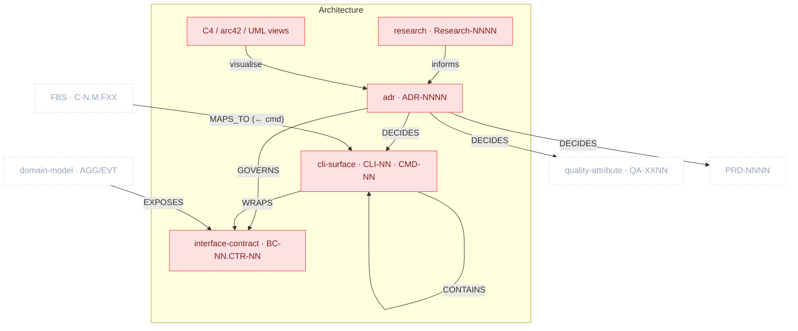

# Architecture Package

> Part of [The Metamodel](../README.md). Prefix `arch-` → `docs/architecture/`.

The **technical-decision and external-surface layer.** It records the decisions (ADRs) and the
research that informs them, defines the contracts the system exposes (service/API and CLI), and
produces the C4/arc42/UML **views** of the rest of the metamodel. ADRs are not in the linear build
chain but gate Quality Attributes and PRDs whose decisions they settle.

## Zoom

Red nodes are inside Architecture; faded dashed nodes are neighbours. `UPPERCASE` edges are typed
relationships clew enforces.

> `CONTAINS` is drawn as a self-loop on cli-surface because CLI commands (`CLI-NN.CMD-NN`) are
> sub-elements of the surface, not a separate node. The C4/arc42/UML node represents diagram
> producers — they mint diagram IDs (`SYS/CON/CMP/DN-NN`, `SCN/CST/CC/RSK-NN`) but are **derived
> views**, deliberately outside the persisted relationship set.

## Artefacts in this package

### research · `Research-NNNN`
Architecture research notes that inform ADR decisions; lifecycle Draft → Active → Frozen → Superseded.
- **Skill:** `arch-research` · **Layout:** one-per-artefact · **Path:** `docs/architecture/research/{nnnn}-{slug}.md`

### adr · `ADR-NNNN`
An Architecture Decision Record (MADR). Gates Quality Attributes (security/flexibility/maintainability) and the PRDs whose choices it settles; governs contract versioning/auth.
- **Skill:** `arch-adr` · **Layout:** one-per-artefact · **Path:** `docs/architecture/decisions/adr-{nnnn}-{slug}.md` · **Frontmatter:** `supersedes`/`superseded_by`

### interface_contract · `BC-NN.CTR-NN`
The external API + async surface per bounded context — REST resources + domain-event topics, error contract, versioning, security.
- **Skill:** `arch-service-contract` · **Layout:** one-per-artefact · **Path:** `docs/architecture/interfaces/{bc-slug}.md`

### cli_surface · `CLI-NN` (+ `cli_command CLI-NN.CMD-NN`)
The CLI command tree — flags, exit codes, output contract — when the product exposes a CLI.
- **Skill:** `arch-cli-contract` · **Layout:** one-per-artefact · **Path:** `docs/architecture/interfaces/cli-{slug}.md`

### C4 / arc42 / UML views — _(diagram IDs only; derived)_
C4 (`arch-c4`/`arch-structurizr`), arc42 narrative (`arch-arc42`), UML (`arch-uml`/`arch-plantuml`). They **visualise** IDs owned elsewhere; they author no persisted relationships.
- **Paths:** `docs/architecture/c4/`, `docs/architecture/arc42/`, `docs/architecture/diagrams/`

## Boundary relationships

| Verb | Source → Target | Card. | Strength | Neighbour package | Meaning |
| :-- | :-- | :-- | :-- | :-- | :-- |
| `EXPOSES` | domain_model → interface_contract | N:M | hard | Domain | Aggregates/events become contract resources |
| `MAPS_TO` | cli_command → fbs_functionality | N:M | hard | Product Specs | CLI commands map to functionalities |
| `DECIDES` | adr → quality_attribute | N:M | soft | Product Specs | ADR decisions inform Security/Flexibility QAs |
| `DECIDES` | adr → prd | N:M | soft | Product Specs | ADR decisions inform PRD architecture |
| `GOVERNS` | adr → interface_contract | N:M | soft | _(intra)_ | ADR governs contract versioning/auth |
| references | interface_contract / cli_command → prd | N:M | soft | Product Specs | PRD acceptance criteria reference CTR/CMD IDs |

---

*Relationship verbs are the canonical types clew stores in `artefact_references.relationship`. Full
catalogue: [`../relationships.md`](../README.md#how-to-read-this-section) (forthcoming).*
