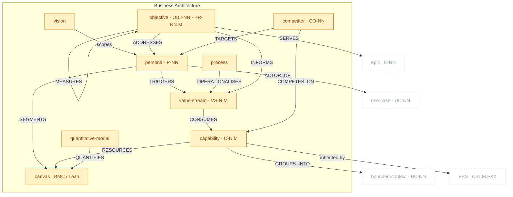

# Business Architecture Package

> Part of [The Metamodel](../README.md). Prefix `business-` → `docs/business/` (vision excepted → `docs/VISION.md`).

The **strategy layer** — BIZBOK Business Architecture. It states *why* the product exists (vision,
objectives), *who* it serves (personas), *what abilities* it needs (capability map), *how value
flows* (value streams), *how it operates* (processes), the *commercial wrapper* (model canvas,
quantitative models), and *who it competes with* (competitive landscape). The capability map is the
hub most downstream artefacts soft-link back to.

## Zoom

Amber nodes are inside Business Architecture; faded dashed nodes are neighbours. `UPPERCASE` edges
are typed relationships clew enforces.

> `MEASURES` is drawn as a self-loop on objective because Key Results (`KR-NN.M`) are sub-elements of
> the objective, not a separate node.

## Artefacts in this package

### vision — _(no ID, singleton)_
The north star — why the product exists, who for, what it is NOT. Soft-links to all downstream.
- **Skill:** `business-vision` · **Layout:** one-per-artefact · **Path:** `docs/VISION.md` (root, for agent-context visibility) · **Mints:** nothing

### persona · `P-NN`
Who the product serves. The most-referenced business artefact (triggers streams, segments the canvas, is the actor of use cases).
- **Skill:** `business-persona` · **Layout:** single-collection · **Path:** `docs/business/01a-personas.md` · **Key props:** `role`, `goals`, `pain_points`

### canvas · _(no ID; blocks `[A-Z]{2}-NN`)_
The commercial wrapper — BMC or Lean Canvas, nine blocks with confidence ratings.
- **Skill:** `business-model-canvas` · **Layout:** one-per-artefact · **Path:** `docs/business/02a-{bmc|lean-canvas}.md` · **Mints (sub):** `bmc_block` IDs

### capability · `C-N.M`
A business ability (tech-independent noun). The **hub** of the metamodel — capabilities are consumed by streams, group into contexts, and seed the FBS.
- **Skill:** `business-capability-map` · **Layout:** single-collection · **Path:** `docs/business/03a-capability-map.md` · **Key prop:** `strategic_importance` (Differentiator/Necessary/Commodity)

### value_stream · `VS-NN` (+ `vs_stage VS-NN.M`)
How value flows to a persona — stages, each consuming capabilities, each with a pain index.
- **Skill:** `business-value-stream` · **Layout:** single-collection · **Path:** `docs/business/04a-value-streams.md` · **Key props:** `value_proposition`, `pain_index`

### objective · `OBJ-NN` (+ `key_result KR-NN.M`)
Strategic intent (BSC-tagged) measured by Key Results (outcome metrics, not output features).
- **Skill:** `business-objective` · **Layout:** single-collection · **Path:** `docs/business/04b-objectives.md` · **Key props:** `perspective`, `timeframe`, `owner`

### process — _(no ID)_
An operational workflow operationalising a value-stream stage (BPMN-ready).
- **Skill:** `business-process` · **Layout:** one-per-artefact · **Path:** `docs/business/05a-processes/proc-NN-{slug}.md`

### quantitative_model — _(no ID)_
The numbers — TAM/SAM/SOM, unit economics, ROI. Quantifies the canvas's Revenue/Cost blocks.
- **Skill:** `business-quantitative-model` · **Layout:** one-per-artefact · **Path:** `docs/business/06a-models/qm-NN-{topic}.md`

### competitor · `CO-NN`
A Tier-1 competitor profile (Porter Five Forces + value curve). Positions against the canvas, maps ICPs to personas.
- **Skill:** `business-competitive-landscape` · **Layout:** one-per-artefact · **Path:** `docs/business/01b-competitive-landscape/{slug}.md`

## Boundary relationships

Out-ports into Domain and Product Specs (in-ports are advisory flows from Discovery — see that page).

| Verb | Source → Target | Card. | Strength | Neighbour package | Meaning |
| :-- | :-- | :-- | :-- | :-- | :-- |
| `GROUPS_INTO` | capability → bounded_context | N:1 | hard | Domain | Capabilities cluster into a context |
| `SIGNALS` | vs_stage → bounded_context | N:M | soft | Domain | Stage boundary signals a context boundary |
| `GROUNDS_BC` | persona → bounded_context | N:M | soft | Domain | Persona grounds the BC's language |
| `INHERITS` | fbs_functionality → capability | N:1 | hard | Product Specs | The FBS inherits the capability map's L0/L1 |
| `ACTOR_OF` | persona → use_case | 1:N | hard | Product Specs | A persona is a use case's primary actor |
| `SERVES` | epic → objective | N:M | soft | Product Specs | Epics serve objectives (Objective×Epic matrix) |

---

*Relationship verbs are the canonical types clew stores in `artefact_references.relationship`. Full
catalogue: [`../relationships.md`](../README.md#how-to-read-this-section) (forthcoming).*
