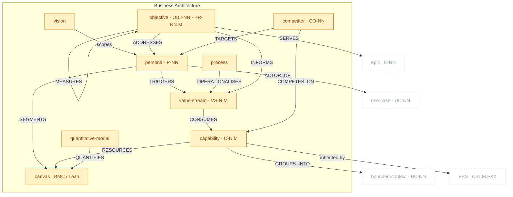

# Business Architecture Package

> Part of [The Metamodel](../README.md). Prefix `business-` → `docs/business/` (vision excepted → `docs/VISION.md`).

The **strategy layer** — BIZBOK Business Architecture. It states *why* the product exists (vision,
objectives), *who* it serves (personas), *what abilities* it needs (capability map), *how value
flows* (value streams), *how it operates* (processes), the *commercial wrapper* (model canvas,
quantitative models), and *who it competes with* (competitive landscape). The capability map is the
hub most downstream artefacts soft-link back to.

## Zoom

Amber nodes are inside Business Architecture; faded dashed nodes are neighbours. `UPPERCASE` edges
are typed relationships clew enforces.

> `MEASURES` is drawn as a self-loop on objective because Key Results (`KR-NN.M`) are sub-elements of
> the objective, not a separate node.

## Artefacts in this package

| Artefact | ID | Minting skill | Layout | Path | Purpose & key properties |
| :-- | :-- | :-- | :-- | :-- | :-- |
| `vision` | — | `business-vision` | one-per-artefact | `docs/VISION.md` | North star — why / who-for / what-NOT. Singleton; soft-links to all downstream. |
| `persona` | `P-NN` | `business-persona` | single-collection | `docs/business/01a-personas.md` | Who the product serves; the most-referenced business artefact. Props: `role`, `goals`, `pain_points`. |
| `canvas` | — _(blocks `[A-Z]{2}-NN`)_ | `business-model-canvas` | one-per-artefact | `02a-bmc.md` / `02a-lean-canvas.md` | Commercial wrapper — nine blocks with confidence ratings. |
| `capability` | `C-N.M` | `business-capability-map` | single-collection | `docs/business/03a-capability-map.md` | Business ability (tech-independent noun) — the metamodel **hub**. Prop: `strategic_importance`. |
| `value_stream` | `VS-NN` _(+ `vs_stage VS-NN.M`)_ | `business-value-stream` | single-collection | `docs/business/04a-value-streams.md` | How value flows to a persona; stages consume capabilities. Props: `value_proposition`, `pain_index`. |
| `objective` | `OBJ-NN` _(+ `KR-NN.M`)_ | `business-objective` | single-collection | `docs/business/04b-objectives.md` | Strategic intent measured by outcome KRs. Props: `perspective`, `timeframe`, `owner`. |
| `process` | — | `business-process` | one-per-artefact | `docs/business/05a-processes/proc-NN-{slug}.md` | Operational workflow operationalising a VS stage (BPMN-ready). |
| `quantitative_model` | — | `business-quantitative-model` | one-per-artefact | `docs/business/06a-models/qm-NN-{topic}.md` | The numbers — TAM/SAM/SOM, unit economics; quantifies the canvas. |
| `competitor` | `CO-NN` | `business-competitive-landscape` | one-per-artefact | `docs/business/01b-competitive-landscape/{slug}.md` | Tier-1 competitor profile (Porter + value curve); positions against the canvas, maps ICPs to personas. |

## Boundary relationships

Out-ports into Domain and Product Specs (in-ports are advisory flows from Discovery — see that page).

| Verb | Source → Target | Card. | Strength | Neighbour package | Meaning |
| :-- | :-- | :-- | :-- | :-- | :-- |
| `GROUPS_INTO` | capability → bounded_context | N:1 | hard | Domain | Capabilities cluster into a context |
| `SIGNALS` | vs_stage → bounded_context | N:M | soft | Domain | Stage boundary signals a context boundary |
| `GROUNDS_BC` | persona → bounded_context | N:M | soft | Domain | Persona grounds the BC's language |
| `INHERITS` | fbs_functionality → capability | N:1 | hard | Product Specs | The FBS inherits the capability map's L0/L1 |
| `ACTOR_OF` | persona → use_case | 1:N | hard | Product Specs | A persona is a use case's primary actor |
| `SERVES` | epic → objective | N:M | soft | Product Specs | Epics serve objectives (Objective×Epic matrix) |

---

*Relationship verbs are the canonical types clew stores in `artefact_references.relationship`. Full
catalogue: [`../relationships.md`](../README.md#how-to-read-this-section) (forthcoming).*
