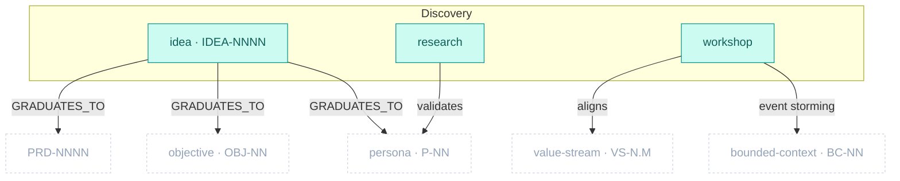

# Discovery Package

> Part of [The Metamodel](../README.md). Prefix `discovery-` → `docs/discovery/`.

The **pre-formal evidence layer.** Discovery is cross-cutting: it sits upstream of everything and
feeds (or reality-checks) every downstream artefact. It captures raw ideas before they have a home,
runs the interviews and workshops that turn `Assumed` claims into `Tested`/`Validated` ones, and
graduates matured ideas into whichever downstream artefact fits. It mints almost no structure of its
own — its value is the evidence it injects elsewhere.

## Zoom

Teal nodes are inside Discovery; faded dashed nodes are downstream artefacts it feeds. `UPPERCASE`
edges are typed relationships clew enforces; lowercase edges are advisory evidence flows the registry
does not type.

## Artefacts in this package

| Artefact | ID | Minting skill | Layout | Path | Purpose & key properties |
| :-- | :-- | :-- | :-- | :-- | :-- |
| `idea` | `IDEA-NNNN` | `discovery-idea` | one-per-artefact | `docs/discovery/ideation/IDEA-{nnnn}-{slug}.md` | Pre-formal idea, refined then **graduated** downstream. The only Discovery artefact with an ID. Prop: `graduates_to`. |
| `research` | — | `discovery-research` | one-per-artefact | `docs/discovery/interviews/` | Hypothesis-anchored interview scripts + synthesis; upgrades `Assumed → Tested → Validated` on business artefacts. |
| `workshop` | — | `discovery-workshop` | one-per-artefact | `docs/discovery/workshops/` | Group facilitation + synthesis; Event Storming mode bridges into Domain (BC boundaries). |

## Boundary relationships

Discovery is all out-ports (it feeds downstream and mints no incoming dependency). Only
`GRADUATES_TO` is a typed edge; the rest are advisory evidence flows.

| Verb | Source → Target | Card. | Strength | Neighbour package | Meaning |
| :-- | :-- | :-- | :-- | :-- | :-- |
| `GRADUATES_TO` | idea → persona/objective/canvas/process/research/adr/fbs/prd | N:0..1 | soft | many | An idea matures into a downstream artefact (one-way; no back-FK) |
| validates | research → persona/canvas/value_stream/quantitative_model/objective | N:M | soft | Business Architecture | Interview synthesis upgrades `Assumed` claims |
| aligns | workshop → vision/canvas/value_stream/capability/objective | N:M | soft | Business Architecture | Group consensus before lock-in |
| event storming | workshop → bounded_context | N:M | soft | Domain | Event Storming surfaces context boundaries |

---

*Relationship verbs are the canonical types clew stores in `artefact_references.relationship`. Full
catalogue: [`../relationships.md`](../relationships.md).*
