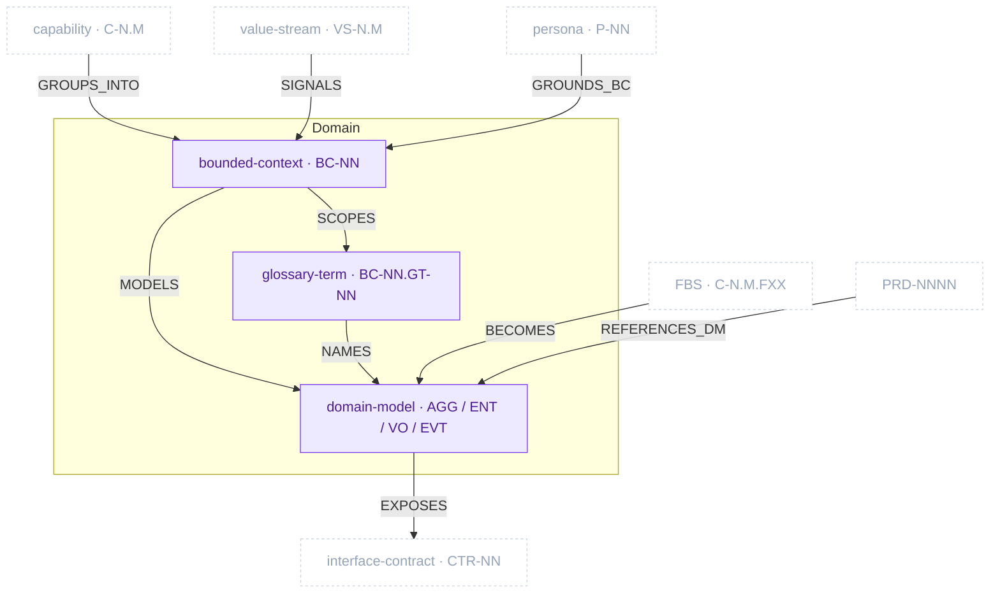

# Domain Package

> Part of [The Metamodel](../README.md). Prefix `domain-` → `docs/domain/`.

The **shared language between business and engineering.** The Domain package carves the problem
space into bounded contexts, fixes the ubiquitous language inside each, and models the tactical
DDD building blocks (aggregates, entities, value objects, domain events) per context. It is the
hinge of the metamodel: business capability and value-stream structure flow *in* and become
bounded contexts; functional specs flow *in* and become aggregates; the resulting model flows *out*
to interface contracts and grounds PRD references.

## Zoom

Purple nodes are inside the Domain package; faded dashed nodes are neighbouring artefacts in other
packages, shown so the boundary is legible. `UPPERCASE` edges are typed relationships clew enforces.

## Artefacts in this package

| Artefact | ID | Minting skill | Layout | Path | Purpose & key properties |
| :-- | :-- | :-- | :-- | :-- | :-- |
| `bounded_context` | `BC-NN` | `domain-bounded-context` | single-collection | `docs/domain/02b-bounded-contexts.md` | The named island of consistent meaning; Core/Supporting/Generic. Scopes the `BC-NN.*` namespace. Props: `subdomain_type`, `responsibility`, `team_owner`. |
| `glossary_term` | `BC-NN.GT-NN` | `domain-glossary` | single-collection | `docs/domain/02c-glossary.md` | One ubiquitous-language entry per BC; no living synonyms within a BC. Props: `definition`, `example`, `aliases`, `code_convention`. |
| `domain_model` | _file-level; mints `BC-NN.AGG/ENT/VO/EVT-NN`_ | `domain-model` | one-per-artefact | `docs/domain/07b-models/{bc-slug}.md` | Tactical DDD model per BC — aggregates + invariants, entities, value objects, domain events. |

> **BC-NN namespace rule.** Every tactical ID is scoped to its bounded context: `BC-01.AGG-03` and
> `BC-02.AGG-03` are different aggregates. Bare `AGG-03` is ambiguous and invalid.

## Planned additions

> Candidate skills from the [kit backlog](https://github.com/VictorHueni/homemade-claude-kit/issues) — not yet shipped.

| Planned skill | Mints | What it will add | Kit issue |
| :-- | :-- | :-- | :-- |
| `domain-event-storming` | `ES-EVT-NN` · `ES-CMD-NN` | Event Storming to discover bounded contexts before Step 2b | [#7](https://github.com/VictorHueni/homemade-claude-kit/issues/7) |
| `domain-integration-contract` | `INT-NN` | A concrete integration contract per BC-pair | [#13](https://github.com/VictorHueni/homemade-claude-kit/issues/13) |

## Boundary relationships

How the Domain package connects to its neighbours (the edges crossing the package border). `hard` =
structural dependency clew enforces the type-pair on; `soft` = advisory enrichment.

| Verb | Source → Target | Card. | Strength | Neighbour package | Meaning |
| :-- | :-- | :-- | :-- | :-- | :-- |
| `GROUPS_INTO` | capability → bounded_context | N:1 | hard | Business Architecture | Capabilities cluster into a bounded context |
| `SIGNALS` | vs_stage → bounded_context | N:M | soft | Business Architecture | A value-stream stage boundary signals a context boundary |
| `GROUNDS_BC` | persona → bounded_context | N:M | soft | Business Architecture | A persona grounds the BC's ubiquitous language |
| `BECOMES` | fbs_functionality → aggregate | N:M | hard | Product Specs | Functionalities become domain aggregates/entities |
| `EXPOSES` | domain_model → interface_contract | N:M | hard | Architecture | Aggregates/events become contract resources |
| `REFERENCES_DM` | prd → aggregate | N:M | soft | Product Specs | A PRD references AGG/EVT IDs |

Intra-package edges (`SCOPES`, `MODELS`, `NAMES`, `EMITS`) are shown on the zoom diagram above.

---

*Relationship verbs are the canonical types clew stores in `artefact_references.relationship`. The
full catalogue lives in [`../relationships.md`](../relationships.md) (which currently mirrors
[`artefact-store.md` §Relationship registry](../../domain/07b-models/artefact-store.md#relationship-registry)).*
