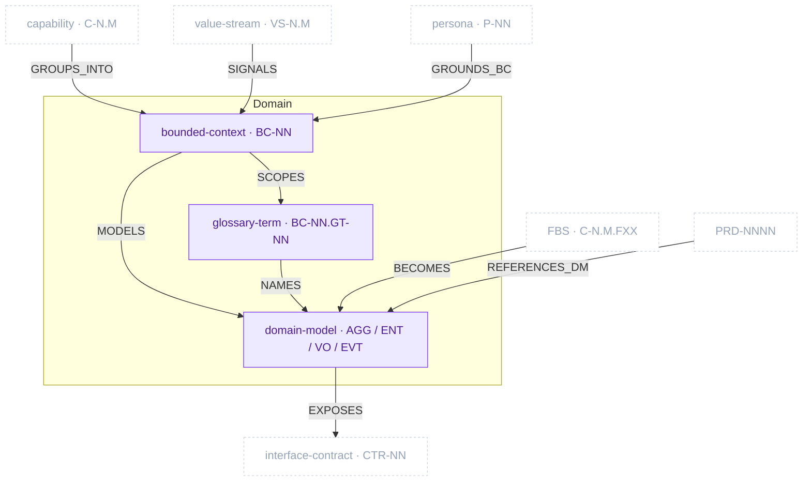

# Domain Package

> Part of [The Metamodel](../README.md). Prefix `domain-` → `docs/domain/`.

The **shared language between business and engineering.** The Domain package carves the problem
space into bounded contexts, fixes the ubiquitous language inside each, and models the tactical
DDD building blocks (aggregates, entities, value objects, domain events) per context. It is the
hinge of the metamodel: business capability and value-stream structure flow *in* and become
bounded contexts; functional specs flow *in* and become aggregates; the resulting model flows *out*
to interface contracts and grounds PRD references.

## Zoom

Purple nodes are inside the Domain package; faded dashed nodes are neighbouring artefacts in other
packages, shown so the boundary is legible. `UPPERCASE` edges are typed relationships clew enforces.

## Artefacts in this package

### bounded_context · `BC-NN`

The named island of consistent domain meaning — where one word has one precise definition and one
team is responsible for it. Classified as **Core** (competitive advantage; build & protect),
**Supporting** (enables Core; build or buy), or **Generic** (commodity; buy SaaS/OSS).

- **Minting skill:** `domain-bounded-context` · **Layout:** single-collection · **Path:** `docs/domain/02b-bounded-contexts.md`
- **Mints:** `BC-NN` (and scopes the `BC-NN.*` namespace for all tactical IDs below)
- **Key properties:** `subdomain_type` (Core/Supporting/Generic), `responsibility`, `rationale`, `team_owner`
- **In:** capability `GROUPS_INTO`, value-stream `SIGNALS`, persona `GROUNDS_BC` · **Out:** `SCOPES` glossary, `MODELS` domain model

### glossary_term · `BC-NN.GT-NN`

One entry of the ubiquitous language, scoped to a bounded context. No living synonyms within a BC;
homonyms across BCs are called out explicitly. Entity, value-object, and event names in the domain
model must reconcile to a glossary term.

- **Minting skill:** `domain-glossary` · **Layout:** single-collection · **Path:** `docs/domain/02c-glossary.md`
- **Mints:** `BC-NN.GT-NN` · **Key properties:** `definition`, `example`, `aliases`, `code_convention`
- **In:** bounded-context `SCOPES` · **Out:** `NAMES` the aggregates/entities of the domain model

### domain_model · _(file-level; mints tactical sub-IDs)_

The tactical DDD model for one bounded context — one file per BC. Holds the aggregates and their
invariants, entities and behaviour, value objects, and domain events.

- **Minting skill:** `domain-model` · **Layout:** one-per-artefact · **Path:** `docs/domain/07b-models/{bc-slug}.md`
- **Mints (sub-elements, BC-scoped):** `BC-NN.AGG-NN` (aggregate), `BC-NN.ENT-NN` (entity), `BC-NN.VO-NN` (value object), `BC-NN.EVT-NN` (domain event)
- **In:** bounded-context `MODELS`, glossary `NAMES`, FBS `BECOMES` (functionalities reveal entities) · **Out:** `EXPOSES` interface contracts; PRD `REFERENCES_DM`
- **Internal:** aggregate `EMITS` domain event

> **BC-NN namespace rule.** Every tactical ID is scoped to its bounded context: `BC-01.AGG-03` and
> `BC-02.AGG-03` are different aggregates. Bare `AGG-03` is ambiguous and invalid.

## Boundary relationships

How the Domain package connects to its neighbours (the edges crossing the package border). `hard` =
structural dependency clew enforces the type-pair on; `soft` = advisory enrichment.

| Verb | Source → Target | Card. | Strength | Neighbour package | Meaning |
| :-- | :-- | :-- | :-- | :-- | :-- |
| `GROUPS_INTO` | capability → bounded_context | N:1 | hard | Business Architecture | Capabilities cluster into a bounded context |
| `SIGNALS` | vs_stage → bounded_context | N:M | soft | Business Architecture | A value-stream stage boundary signals a context boundary |
| `GROUNDS_BC` | persona → bounded_context | N:M | soft | Business Architecture | A persona grounds the BC's ubiquitous language |
| `BECOMES` | fbs_functionality → aggregate | N:M | hard | Product Specs | Functionalities become domain aggregates/entities |
| `EXPOSES` | domain_model → interface_contract | N:M | hard | Architecture | Aggregates/events become contract resources |
| `REFERENCES_DM` | prd → aggregate | N:M | soft | Product Specs | A PRD references AGG/EVT IDs |

Intra-package edges (`SCOPES`, `MODELS`, `NAMES`, `EMITS`) are shown on the zoom diagram above.

---

*Relationship verbs are the canonical types clew stores in `artefact_references.relationship`. The
full catalogue across all packages will live in [`../relationships.md`](../README.md#how-to-read-this-section)
(forthcoming); until then see [`../../domain/07b-models/artefact-store.md` §Relationship registry](../../domain/07b-models/artefact-store.md#relationship-registry).*
