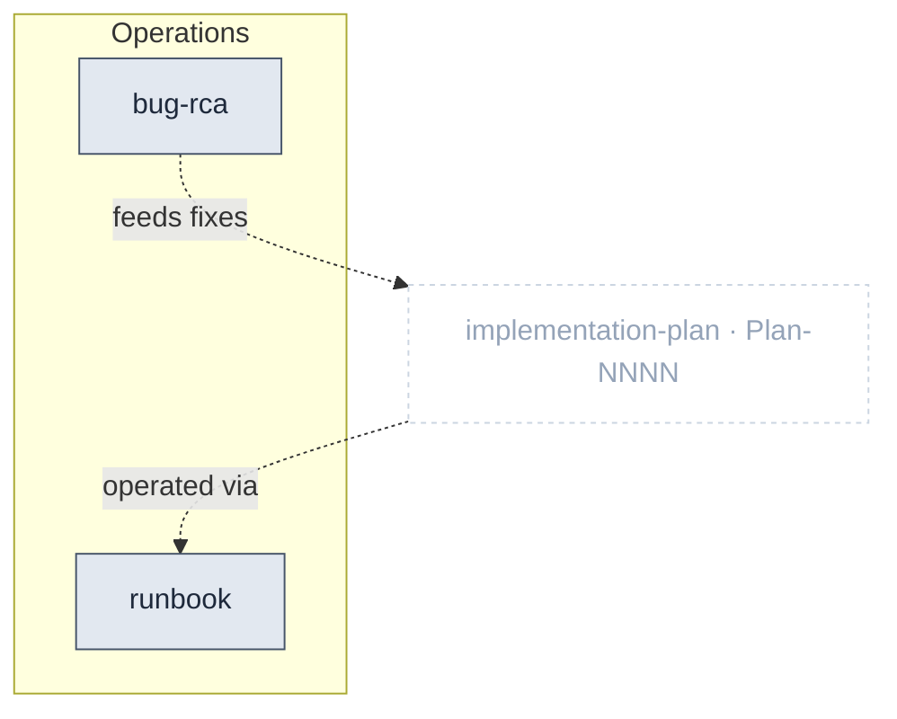

# Operations Package

> Part of [The Metamodel](../README.md). Prefix `ops-` → `docs/ops/`.

The **post-ship layer.** Operations artefacts are captured *after* delivery — operational procedures
(runbooks) and root-cause analyses (bug RCAs). They are real metamodel artefacts but **mint no IDs**
and sit outside the authoring build order; their links back into the spec layer are advisory
(post-ship lifecycle, no enforced FK).

## Zoom

Slate nodes are inside Operations; the faded dashed node is the upstream artefact they attach to.
Dashed edges are post-ship lifecycle links — no enforced foreign key.

## Artefacts in this package

| Artefact | ID | Minting skill | Layout | Path | Purpose & key properties |
| :-- | :-- | :-- | :-- | :-- | :-- |
| `runbook` | — | `ops-runbook` | one-per-artefact | `docs/ops/runbooks/{slug}.md` | An operational procedure captured post-ship — how to run, recover, respond. |
| `bug_rca` | — | `ops-bug-rca` | one-per-artefact | `docs/ops/rcas/{YYYY-MM-DD}-{slug}.md` | A post-incident root-cause analysis; feeds corrective work into implementation plans. |

> Infra provisioning (`ops-terraform-exoscale`) also lives under the `ops-` umbrella but is tooling,
> not a metamodel artefact (mints no IDs, produces no governed doc).

## Planned additions

> Candidate skills from the [kit backlog](https://github.com/VictorHueni/homemade-claude-kit/issues) — not yet shipped.

| Planned skill | Mints | What it will add | Kit issue |
| :-- | :-- | :-- | :-- |
| `ops-slo` | `SLO-NN` | SLI/SLO/error budgets derived from `QA-XXNN` | [#11](https://github.com/VictorHueni/homemade-claude-kit/issues/11) |
| `ops-post-mortem` | _TBD_ | Blameless incident review (broader than `ops-bug-rca`) | [#16](https://github.com/VictorHueni/homemade-claude-kit/issues/16) |

## Boundary relationships

Both edges are **post-ship, soft, no enforced FK** (dashed on every diagram).

| Verb | Source → Target | Strength | Neighbour package | Meaning |
| :-- | :-- | :-- | :-- | :-- |
| operated via | implementation_plan → runbook | soft | Product Specs | A shipped increment is operated via runbooks |
| feeds fixes | bug_rca → implementation_plan | soft | Product Specs | An RCA feeds corrective increments |

---

*Relationship verbs are the canonical types clew stores in `artefact_references.relationship`. Full
catalogue: [`../relationships.md`](../README.md#how-to-read-this-section) (forthcoming).*
