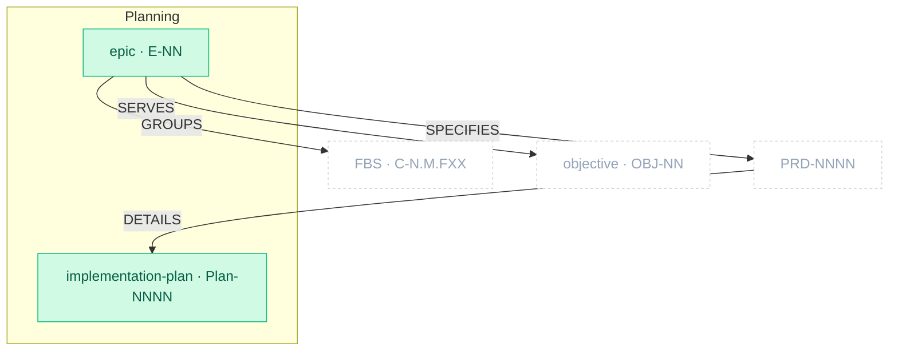

# Planning Package

> Part of [The Metamodel](../README.md). Prefix `plan-` → `docs/plans/`. New in [ADR-0009](../../architecture/decisions/adr-0009-plan-package-split-from-product-specs.md).

The **build-planning layer** — *how and in what order* the product gets built. Split from Product
Specs ([ADR-0009](../../architecture/decisions/adr-0009-plan-package-split-from-product-specs.md))
because these are specifications of *intended sequence*, not of the product itself: the delivery
roadmap groups functionality into ordered epics (Plan by Feature, walking skeleton, phase goals), and
the implementation plans break each PRD into atomic increments. Still "what must be true" — about the
*plan* — and deliberately not delivery *tracking* (the VISION's line: clew is not a ticketing tool).

## Zoom

Green nodes are inside Planning; faded dashed nodes are neighbours. `UPPERCASE` edges are typed
relationships clew enforces. Planning is tightly interwoven with Product Specs — epics group/spec its
artefacts, and plans detail its PRDs.

## Artefacts in this package

| Artefact | ID | Minting skill | Layout | Path | Purpose & key properties |
| :-- | :-- | :-- | :-- | :-- | :-- |
| `epic` | `E-NN` | `plan-delivery-roadmap` | single-collection | `docs/plans/delivery-roadmap.md` | Delivery grouping (Plan by Feature) — FBS clustered by VS stage + capability, ordered by pain index; carries the walking skeleton + phase goals. Props: `phase`, `value_statement`. |
| `implementation_plan` | `Plan-NNNN` | `plan-implementation` | one-per-artefact | `docs/plans/active/{nnnn}_exec_{slug}.md` | Atomic, testable, reversible increments — one plan per PRD. |

> **Skill renames (ADR-0009).** `spec-delivery-roadmap` → `plan-delivery-roadmap`;
> `spec-implementation-plan` → `plan-implementation`. Artefact types and IDs are unchanged — only the
> skill, package, and path moved. The kit cascade (registry + path migration) is OI-0061 on ADR-0009.

## Boundary relationships

Planning has no internal edges — its two artefacts link through Product Specs (epic → PRD → plan).

| Verb | Source → Target | Card. | Strength | Neighbour package | Meaning |
| :-- | :-- | :-- | :-- | :-- | :-- |
| `GROUPS` | epic → fbs_functionality | 1:N | hard | Product Specs | Epic groups FBS functionalities |
| `SPECIFIES` | epic → prd | 1:1 | hard | Product Specs | One PRD per epic |
| `DETAILS` | prd → implementation_plan | 1:1 | hard | Product Specs | One implementation plan per PRD |
| `SERVES` | epic → objective | N:M | soft | Business Architecture | Epics serve objectives (Objective×Epic matrix) |
| scoped by | cli_command → epic | N:M | soft | Architecture | CLI commands scoped by delivery phase |
| operated via | implementation_plan → runbook | N:M | soft | Operations | Shipped increments are operated post-ship |

## Planned additions

> Candidate skills from the [kit backlog](https://github.com/VictorHueni/homemade-claude-kit/issues) — not yet shipped.

| Planned skill | Mints | What it will add | Kit issue |
| :-- | :-- | :-- | :-- |
| `plan-release` | _TBD_ | Rollout / comms / rollback plan per `E-NN` (was the proposed `spec-release-plan`) | [#15](https://github.com/VictorHueni/homemade-claude-kit/issues/15) |

---

*Relationship verbs are the canonical types clew stores in `artefact_references.relationship`. Full
catalogue: [`../relationships.md`](../relationships.md).*
