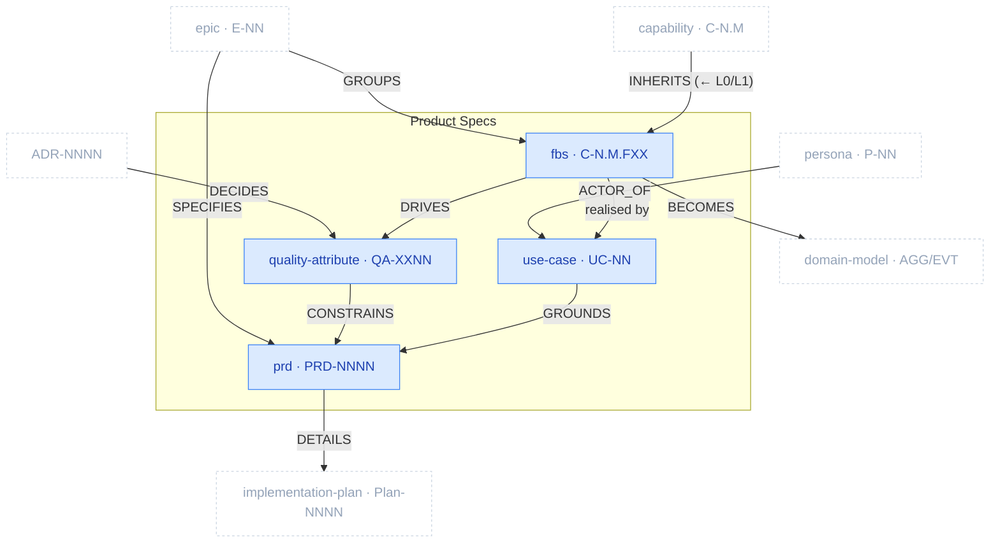

# Product Specs Package

> Part of [The Metamodel](../README.md). Prefix `spec-` → `docs/product-specs/`.

The **product specification layer** — *what the product does and how well*. It registers functionality
(FBS), sets the non-functional bar (quality attributes), captures behaviour as use cases, and lands it
all in PRDs. This is where business intent and domain structure converge into specified, buildable
units. The delivery roadmap and implementation plans that *sequence and execute* these moved to the
[Planning](planning.md) package ([ADR-0009](../../architecture/decisions/adr-0009-plan-package-split-from-product-specs.md))
— this package is now pure product specification.

## Zoom

Blue nodes are inside Product Specs; faded dashed nodes are neighbours. `UPPERCASE` edges are typed
relationships clew enforces. Note the tight interweave with **Planning**: epics group/spec these
artefacts, and PRDs detail into plans.

## Artefacts in this package

| Artefact | ID | Minting skill | Layout | Path | Purpose & key properties |
| :-- | :-- | :-- | :-- | :-- | :-- |
| `fbs_functionality` | `C-N.M.FXX` | `spec-functional-breakdown-structure` | single-collection | `docs/product-specs/07a-fbs.md` | Functionality registry, status-tracked; inherits L0/L1. Props: `status`, `complexity`, `is_differentiator`. |
| `quality_attribute` | `QA-XXNN` | `spec-quality-attributes` | single-collection | `docs/product-specs/09a-quality-attributes.md` | Non-functional bar (ISO/IEC 25010) with measurable acceptance criteria. |
| `use_case` | `UC-NN` | `spec-use-case` | one-per-artefact | `docs/product-specs/use-cases/uc-NN-{slug}.md` | Actor↔system scenario (all paths + guarantees); grounds PRD acceptance criteria. |
| `prd` | `PRD-NNNN` | `spec-prd` | one-per-artefact | `docs/product-specs/prds/prd-NNNN-{feature}.md` | Feature spec, one per epic; §0 traces E-NN / P-NN / C-N.M / QA-XXNN / UC-NN. |

> **Moved to [Planning](planning.md) (ADR-0009):** `epic` (`E-NN`, was `spec-delivery-roadmap`) and
> `implementation_plan` (`Plan-NNNN`, was `spec-implementation-plan`). Artefact types/IDs unchanged.

## Boundary relationships

| Verb | Source → Target | Card. | Strength | Neighbour package | Meaning |
| :-- | :-- | :-- | :-- | :-- | :-- |
| `INHERITS` | fbs_functionality → capability | N:1 | hard | Business Architecture | FBS inherits the capability map's L0/L1 |
| `ACTOR_OF` | persona → use_case | 1:N | hard | Business Architecture | Persona is the use case's primary actor |
| `GROUPS` | epic → fbs_functionality | 1:N | hard | Planning | Epic groups FBS functionalities |
| `SPECIFIES` | epic → prd | 1:1 | hard | Planning | One PRD per epic |
| `DETAILS` | prd → implementation_plan | 1:1 | hard | Planning | One implementation plan per PRD |
| `BECOMES` | fbs_functionality → aggregate | N:M | hard | Domain | Functionalities become domain aggregates |
| `REFERENCES_DM` | prd → aggregate | N:M | soft | Domain | PRD references AGG/EVT IDs |
| `DECIDES` | adr → quality_attribute / prd | N:M | soft | Architecture | ADR decisions inform QAs and PRDs |
| `MAPS_TO` | cli_command → fbs_functionality | N:M | hard | Architecture | CLI commands map to functionalities |
| realises | use_case → test_scenario | N:M | hard | Quality Assurance | A use case's flows become test scenarios |
| defines tests for | quality_attribute → test_strategy | N:M | soft | Quality Assurance | QAs are what the tests verify |

---

*Relationship verbs are the canonical types clew stores in `artefact_references.relationship`. Full
catalogue: [`../relationships.md`](../relationships.md).*
