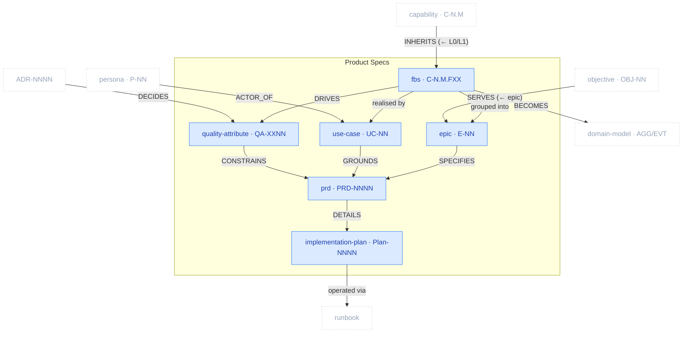

# Product Specs Package

> Part of [The Metamodel](../README.md). Prefix `spec-` → `docs/product-specs/` + `docs/exec-plans/`.

The **specification layer** — what the product does and how well, sequenced into deliverable work.
It registers functionality (FBS), groups it into delivery epics, sets the non-functional bar
(quality attributes), captures behaviour as use cases, and lands it all in PRDs and the atomic
implementation plans that execute them. This is where business intent and domain structure converge
into buildable units.

## Zoom

Blue nodes are inside Product Specs; faded dashed nodes are neighbours. `UPPERCASE` edges are typed
relationships clew enforces.

## Artefacts in this package

### fbs_functionality · `C-N.M.FXX`
The functionality registry — one row per capability function, status-tracked (✅/🔄/⬜). Inherits L0/L1 from the capability map.
- **Skill:** `spec-functional-breakdown-structure` · **Layout:** single-collection · **Path:** `docs/product-specs/07a-fbs.md` · **Key props:** `status`, `complexity`, `is_differentiator`

### epic · `E-NN`
A delivery grouping (Plan by Feature) — FBS functionalities clustered by VS stage + capability, ordered by pain index.
- **Skill:** `spec-delivery-roadmap` · **Layout:** single-collection · **Path:** `docs/product-specs/08a-delivery-roadmap.md` · **Key props:** `phase`, `value_statement`

### quality_attribute · `QA-XXNN`
The non-functional bar (ISO/IEC 25010) — measurable acceptance criteria per sub-characteristic.
- **Skill:** `spec-quality-attributes` · **Layout:** single-collection · **Path:** `docs/product-specs/09a-quality-attributes.md`

### use_case · `UC-NN`
The actor↔system behavioural scenario — all paths + guarantees. Grounds PRD acceptance criteria.
- **Skill:** `spec-use-case` · **Layout:** one-per-artefact · **Path:** `docs/product-specs/use-cases/uc-NN-{slug}.md`

### prd · `PRD-NNNN`
The feature spec (Build by Feature) — one per epic; §0 traces E-NN, P-NN, C-N.M, QA-XXNN, UC-NN.
- **Skill:** `spec-prd` · **Layout:** one-per-artefact · **Path:** `docs/product-specs/prds/prd-NNNN-{feature}.md`

### implementation_plan · `Plan-NNNN`
Atomic, testable, reversible increments — one plan per PRD. Outputs to `docs/exec-plans/` (still `spec-`).
- **Skill:** `spec-implementation-plan` · **Layout:** one-per-artefact · **Path:** `docs/exec-plans/active/{nnnn}_exec_{slug}.md`

## Boundary relationships

| Verb | Source → Target | Card. | Strength | Neighbour package | Meaning |
| :-- | :-- | :-- | :-- | :-- | :-- |
| `INHERITS` | fbs_functionality → capability | N:1 | hard | Business Architecture | FBS inherits the capability map's L0/L1 |
| `ACTOR_OF` | persona → use_case | 1:N | hard | Business Architecture | Persona is the use case's primary actor |
| `SERVES` | epic → objective | N:M | soft | Business Architecture | Epics serve objectives |
| `BECOMES` | fbs_functionality → aggregate | N:M | hard | Domain | Functionalities become domain aggregates |
| `REFERENCES_DM` | prd → aggregate | N:M | soft | Domain | PRD references AGG/EVT IDs |
| `DECIDES` | adr → quality_attribute / prd | N:M | soft | Architecture | ADR decisions inform QAs and PRDs |
| `MAPS_TO` | cli_command → fbs_functionality | N:M | hard | Architecture | CLI commands map to functionalities |
| realises | use_case → test_scenario | N:M | hard | Quality Assurance | A use case's flows become test scenarios |
| defines tests for | quality_attribute → test_strategy | N:M | soft | Quality Assurance | QAs are what the tests verify |
| operated via | implementation_plan → runbook | N:M | soft | Operations | Shipped increments are operated post-ship |

---

*Relationship verbs are the canonical types clew stores in `artefact_references.relationship`. Full
catalogue: [`../relationships.md`](../README.md#how-to-read-this-section) (forthcoming).*
