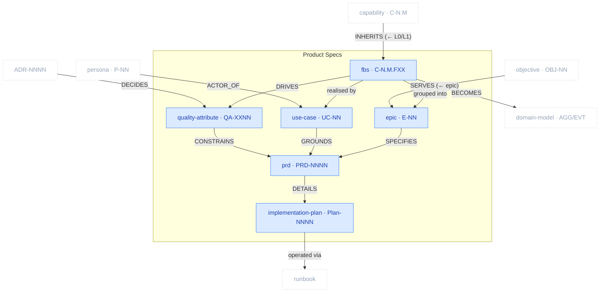

# Product Specs Package

> Part of [The Metamodel](../README.md). Prefix `spec-` → `docs/product-specs/` + `docs/exec-plans/`.

The **specification layer** — what the product does and how well, sequenced into deliverable work.
It registers functionality (FBS), groups it into delivery epics, sets the non-functional bar
(quality attributes), captures behaviour as use cases, and lands it all in PRDs and the atomic
implementation plans that execute them. This is where business intent and domain structure converge
into buildable units.

## Zoom

Blue nodes are inside Product Specs; faded dashed nodes are neighbours. `UPPERCASE` edges are typed
relationships clew enforces.

## Artefacts in this package

| Artefact | ID | Minting skill | Layout | Path | Purpose & key properties |
| :-- | :-- | :-- | :-- | :-- | :-- |
| `fbs_functionality` | `C-N.M.FXX` | `spec-functional-breakdown-structure` | single-collection | `docs/product-specs/07a-fbs.md` | Functionality registry, status-tracked; inherits L0/L1. Props: `status`, `complexity`, `is_differentiator`. |
| `epic` | `E-NN` | `spec-delivery-roadmap` | single-collection | `docs/product-specs/08a-delivery-roadmap.md` | Delivery grouping (Plan by Feature), ordered by pain index. Props: `phase`, `value_statement`. |
| `quality_attribute` | `QA-XXNN` | `spec-quality-attributes` | single-collection | `docs/product-specs/09a-quality-attributes.md` | Non-functional bar (ISO/IEC 25010) with measurable acceptance criteria. |
| `use_case` | `UC-NN` | `spec-use-case` | one-per-artefact | `docs/product-specs/use-cases/uc-NN-{slug}.md` | Actor↔system scenario (all paths + guarantees); grounds PRD acceptance criteria. |
| `prd` | `PRD-NNNN` | `spec-prd` | one-per-artefact | `docs/product-specs/prds/prd-NNNN-{feature}.md` | Feature spec, one per epic; §0 traces E-NN / P-NN / C-N.M / QA-XXNN / UC-NN. |
| `implementation_plan` | `Plan-NNNN` | `spec-implementation-plan` | one-per-artefact | `docs/exec-plans/active/{nnnn}_exec_{slug}.md` | Atomic, testable, reversible increments — one plan per PRD (note: `docs/exec-plans/`, still `spec-`). |

## Planned additions

> Candidate skills from the [kit backlog](https://github.com/VictorHueni/homemade-claude-kit/issues) — not yet shipped.

| Planned skill | Mints | What it will add | Kit issue |
| :-- | :-- | :-- | :-- |
| `spec-release-plan` | _TBD_ | Rollout / comms / rollback plan per `E-NN` | [#15](https://github.com/VictorHueni/homemade-claude-kit/issues/15) |

## Boundary relationships

| Verb | Source → Target | Card. | Strength | Neighbour package | Meaning |
| :-- | :-- | :-- | :-- | :-- | :-- |
| `INHERITS` | fbs_functionality → capability | N:1 | hard | Business Architecture | FBS inherits the capability map's L0/L1 |
| `ACTOR_OF` | persona → use_case | 1:N | hard | Business Architecture | Persona is the use case's primary actor |
| `SERVES` | epic → objective | N:M | soft | Business Architecture | Epics serve objectives |
| `BECOMES` | fbs_functionality → aggregate | N:M | hard | Domain | Functionalities become domain aggregates |
| `REFERENCES_DM` | prd → aggregate | N:M | soft | Domain | PRD references AGG/EVT IDs |
| `DECIDES` | adr → quality_attribute / prd | N:M | soft | Architecture | ADR decisions inform QAs and PRDs |
| `MAPS_TO` | cli_command → fbs_functionality | N:M | hard | Architecture | CLI commands map to functionalities |
| realises | use_case → test_scenario | N:M | hard | Quality Assurance | A use case's flows become test scenarios |
| defines tests for | quality_attribute → test_strategy | N:M | soft | Quality Assurance | QAs are what the tests verify |
| operated via | implementation_plan → runbook | N:M | soft | Operations | Shipped increments are operated post-ship |

---

*Relationship verbs are the canonical types clew stores in `artefact_references.relationship`. Full
catalogue: [`../relationships.md`](../relationships.md).*
