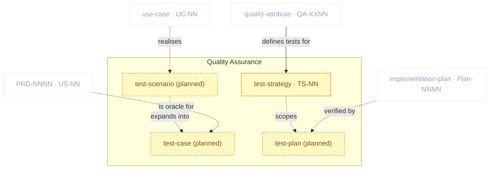

# Quality Assurance Package

> Part of [The Metamodel](../README.md). Prefix `qa-` → `docs/qa/`. **Partially active** —
> `qa-test-strategy` ships; the rest of the package remains a governance reservation.

The **validate / test layer**, sitting between implementation plans and deploy/ops. It produces the
*tests* that verify the `QA-XXNN` quality requirements the Product Specs package *defines* — the two
are distinct: `spec-quality-attributes` states the bar; `qa-*` proves the system meets it.
`test_strategy` (`TS-NN`) is the first artefact to ship; `test_scenario`/`test_plan`/acceptance/eval
remain **planned** — see below.

## Zoom

The gold node is active; sand-dashed nodes are still reserved (planned, no skill); faded dashed nodes
are neighbours that feed them. Solid edges from/to the active node are enforced by the shipped skill;
dashed edges stay advisory until their sibling skills ship.

A user story is verified directly by its own test case (its acceptance criteria *are* the oracle) — it
does not need a use case in between. A use case's flows still go through a test scenario first, which
then expands into one or more test cases. Both paths converge on `test_case`; the concrete ID scheme
(`UC-NN.TC-NN` for the use-case path, `PRD-NNNN.US-NN.TC-NN` for the direct user-story path) is a kit
`qa-test-scenario` design detail, not a clew structural fact — a story that escalates to a use case
(`Covers:` set) is tested via the use case, not both.

## Artefacts in this package

| Artefact | ID | Minting skill | Layout | Path | Purpose & key properties |
| :-- | :-- | :-- | :-- | :-- | :-- |
| `test_strategy` | `TS-NN` | `qa-test-strategy` | single-collection | `docs/qa/test-strategy.md` | Test pyramid allocation + the `QA-XXNN`→test-type mapping + entry/exit criteria. Policy only — no test cases or run results live here (see Planned additions). |

> **Distinct from `spec-quality-attributes`.** That skill defines the `QA-XXNN` *requirements*; this
> package produces the *tests* that prove them. Don't merge the two — kept as separate packages
> (Product Specs vs. Quality Assurance) even though `spec-quality-attributes` and `qa-test-strategy`
> are grouped into the same kit-side plugin for install convenience.

## Planned additions

> Candidate skills from the [kit backlog](https://github.com/VictorHueni/homemade-claude-kit/issues) — not yet shipped.

| Planned skill | Mints | What it will add | Kit issue |
| :-- | :-- | :-- | :-- |
| `qa-test-scenario` | — | Mints `test_scenario` and `test_case`. A `UC-NN`'s flows *realise* scenarios, which expand into cases; a `PRD-NNNN.US-NN` without a `UC-NN` (no escalation) is the *oracle* for its own case directly | not yet filed |
| `qa-test-plan` · `qa-acceptance-test` · `qa-eval-harness` | — | Executable test plans + harnesses verifying an `implementation_plan`, plus run-result logging | not yet filed |

## Boundary relationships

| Verb | Source → Target | Strength | Neighbour package | Meaning |
| :-- | :-- | :-- | :-- | :-- |
| defines tests for | quality_attribute → test_strategy | soft | Product Specs | The QAs are what the strategy's mapping table verifies — **active** |
| realises | use_case → test_scenario | soft | Product Specs | Use-case flows become test scenarios — planned, inert until `qa-test-scenario` ships |
| expands into | test_scenario → test_case | soft | — *(intra-package)* | A scenario expands into one or more concrete cases — planned, inert until `qa-test-scenario` ships |
| is oracle for | user_story → test_case | soft | Product Specs | The story's own acceptance criteria are the pass/fail oracle for its test case — used when the story has not escalated to a use case (no `Covers:` UC); planned, inert until `qa-test-scenario` ships |
| verified by | implementation_plan → test_plan | soft | Product Specs | Increments are checked against the plan — planned, inert until `qa-test-plan` ships |

> **Kit tracking.** `qa-test-strategy` (`TS-NN`) is active, tracked at [kit #8](https://github.com/VictorHueni/homemade-claude-kit/issues/8); the `qa-test-scenario` / `qa-test-plan` / `qa-acceptance-test` / `qa-eval-harness` family remains reserved (named in the metamodel rule, no issues filed yet).

---

*Relationship verbs are the canonical types clew stores in `artefact_references.relationship`. Full
catalogue: [`../relationships.md`](../relationships.md).*
