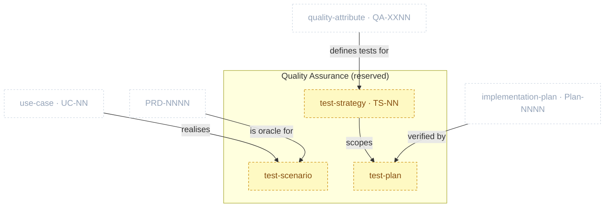

# Quality Assurance Package

> Part of [The Metamodel](../README.md). Prefix `qa-` → `docs/qa/`. **Reserved — no skill ships yet.**

The **validate / test layer**, sitting between implementation plans and deploy/ops. It produces the
*tests* that verify the `QA-XXNN` quality requirements the Product Specs package *defines* — the two
are distinct: `spec-quality-attributes` states the bar; `qa-*` proves the system meets it. This
package is a **governance reservation**: the category and ID (`TS-NN`) are minted, but no skill is
built, so every artefact below is **planned**.

## Zoom

Sand nodes are inside QA (all planned); faded dashed nodes are neighbours that feed them. Edges are
the intended relationships, not yet enforced (no skill).

## Artefacts in this package (all planned)

| Artefact | ID | Minting skill | Layout | Path | Purpose & key properties |
| :-- | :-- | :-- | :-- | :-- | :-- |
| `test_strategy` | `TS-NN` _(planned)_ | `qa-test-strategy` _(planned)_ | — | `docs/qa/test-strategy/` | Test pyramid + coverage + the `QA-XXNN`→test-type mapping. The lead artefact; mints `TS-NN`. |
| `test_scenario` | — _(planned)_ | `qa-test-scenario` _(planned)_ | — | `docs/qa/` | *Realises* a `UC-NN`: its flows become test scenarios, with PRD acceptance criteria as the oracle. |
| `test_plan` · acceptance · eval | — _(planned)_ | `qa-test-plan` · `qa-acceptance-test` · `qa-eval-harness` _(planned)_ | — | `docs/qa/` | Executable test plans + harnesses verifying the strategy's coverage. |

> **Distinct from `spec-quality-attributes`.** That skill defines the `QA-XXNN` *requirements*; this
> package will produce the *tests* that prove them. Don't merge the two.

## Boundary relationships (intended)

All in-ports; none enforced yet (no skill). They activate when the first `qa-` skill ships.

| Verb | Source → Target | Strength | Neighbour package | Meaning |
| :-- | :-- | :-- | :-- | :-- |
| defines tests for | quality_attribute → test_strategy | soft | Product Specs | The QAs are what the tests verify |
| realises | use_case → test_scenario | hard | Product Specs | Use-case flows become test scenarios |
| is oracle for | prd → test_scenario | soft | Product Specs | PRD acceptance criteria are the pass/fail oracle |
| verified by | implementation_plan → test_plan | soft | Product Specs | Increments are checked against the plan |

> **Distinct from `spec-quality-attributes`.** That skill defines the `QA-XXNN` *requirements*; this
> package will produce the *tests* that prove them. Don't merge the two.

---

*Relationship verbs are the canonical types clew stores in `artefact_references.relationship`. Full
catalogue: [`../relationships.md`](../README.md#how-to-read-this-section) (forthcoming).*
