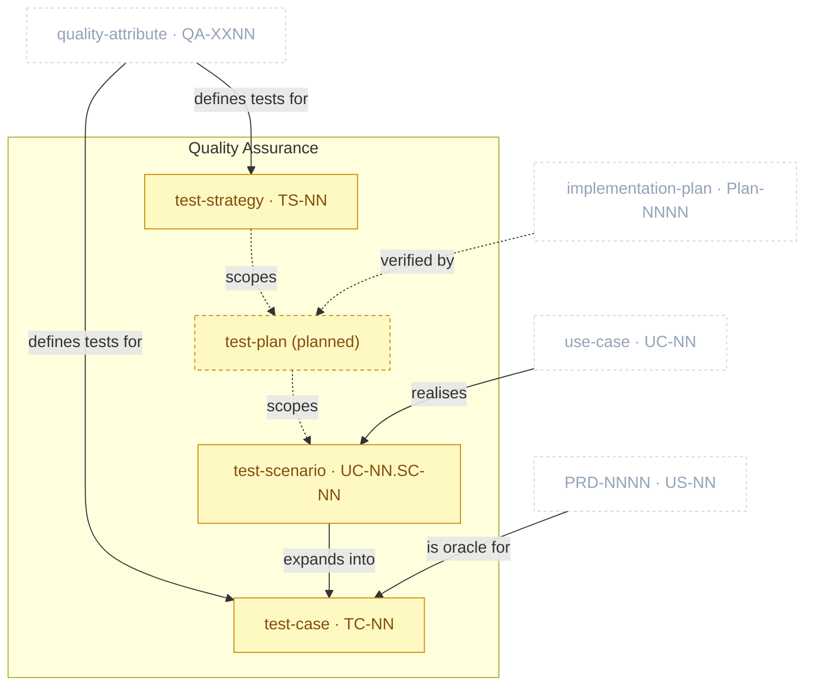

# Quality Assurance Package

> Part of [The Metamodel](../README.md). Prefix `qa-` → `docs/qa/`. **Partially active** —
> `qa-test-strategy` and `qa-test-scenario` ship; `test_plan`/acceptance-test remain a governance
> reservation.

The **validate / test layer**, sitting between implementation plans and deploy/ops. It produces the
*tests* that verify the `QA-XXNN` quality requirements the Product Specs package *defines* — the two
are distinct: `spec-quality-attributes` states the bar; `qa-*` proves the system meets it.
`test_strategy` (`TS-NN`) shipped first; `test_scenario`/`test_case` (`qa-test-scenario`) ship next;
`test_plan`/acceptance-test remain **planned** — see below.

## Zoom

Gold nodes are active; sand-dashed nodes are still reserved (planned, no skill); faded dashed nodes
are neighbours that feed them. Solid edges are enforced by a shipped skill; dashed edges stay advisory
until their sibling skill ships.

The natural authoring chain is **strategy → plan → scenario → case** (ISTQB / ISO 29119-3); only the
`test_plan` tier remains unbuilt, so it still scopes nothing yet. Three paths reach `test_case`, each
skipping the scenario tier except the first: a use case's flows go through a `test_scenario` first
(one per main-success-scenario/extension, Cockburn derivation), which expands into one or more cases;
a user story with no use-case escalation is verified directly by its own case (its acceptance criteria
*are* the oracle — no scenario in between); a quality attribute reaches its case directly too (its
`QA-XXNN` row is already a stimulus/response *scenario* in the Bass/Clements/Kazman sense, so no
separate `test_scenario` artefact is needed for it). A story that later escalates to a use case
(`Covers:` set) is tested via the use case from that point on — retire the direct case, don't keep
both.

## Artefacts in this package

| Artefact | ID | Minting skill | Layout | Path | Purpose & key properties |
| :-- | :-- | :-- | :-- | :-- | :-- |
| `test_strategy` | `TS-NN` | `qa-test-strategy` | single-collection | `docs/qa/test-strategy.md` | Test pyramid allocation + the `QA-XXNN`→test-type mapping + entry/exit criteria. Policy only — no test cases or run results live here. |
| `test_scenario` | `UC-NN.SC-NN` | `qa-test-scenario` | single-collection | `docs/qa/test-scenarios.md` | One per use-case flow (main success scenario or extension) — a data-free "what to test" statement with source citation, precondition, and risk-based priority. Use-case path only; the story and QA paths below go straight to `test_case`. |
| `test_case` | `UC-NN.SC-NN.TC-NN` \| `PRD-NNNN.US-NN.TC-NN` \| `QA-XXNN.TC-NN` | `qa-test-scenario` | single-collection | `docs/qa/test-scenarios.md` | The concrete verification artefact: Gherkin (`Given`/`When`/`Then`, one per flow/extension or story) for the use-case/story paths, tabular stimulus/response (Bass/Clements/Kazman shape) for the quality-attribute path. Never both ID shapes for the same requirement. |

> **Distinct from `spec-quality-attributes`.** That skill defines the `QA-XXNN` *requirements*; this
> package produces the *tests* that prove them. Don't merge the two — kept as separate packages
> (Product Specs vs. Quality Assurance) even though `spec-quality-attributes` and the `qa-*` skills
> are grouped into the same kit-side plugin for install convenience.

## Planned additions

> Candidate skills from the [kit backlog](https://github.com/VictorHueni/homemade-claude-kit/issues) — not yet shipped.

| Planned skill | Mints | What it will add | Kit issue |
| :-- | :-- | :-- | :-- |
| `qa-test-plan` | `test_plan` | Scoped by `test_strategy` and in turn scoping which `test_scenario`s/`test_case`s fall within a cycle/release (ISTQB/ISO 29119-3 strategy→plan→scenario→case chain) | not yet filed |
| `qa-acceptance-test` | — | Executes the scoped `test_case`s against an `implementation_plan`, logs run results, and files a bug on failure. **Absorbs the formerly separate, now-dropped `qa-eval-harness`** — "eval harness" collided with the unrelated agent-evaluation sense of "eval" used elsewhere (see [agent.md](agent.md)'s Planned additions); this skill was always the one actually described as running tests and logging results, so the name it keeps is the accurate one | not yet filed |

## Boundary relationships

| Verb | Source → Target | Strength | Neighbour package | Meaning |
| :-- | :-- | :-- | :-- | :-- |
| defines tests for | quality_attribute → test_strategy | soft | Product Specs | The QAs are what the strategy's mapping table verifies — **active** |
| defines tests for | quality_attribute → test_case | soft | Product Specs | A QA row anchors its own tabular test case directly, no scenario tier — **active** |
| realises | use_case → test_scenario | soft | Product Specs | Use-case flows become test scenarios, one per flow — **active** |
| expands into | test_scenario → test_case | soft | — *(intra-package)* | A scenario expands into one or more concrete cases — **active** |
| is oracle for | user_story → test_case | soft | Product Specs | The story's own acceptance criteria are the pass/fail oracle for its test case — used when the story has not escalated to a use case (no `Covers:` UC) — **active** |
| scopes | test_plan → test_scenario | soft | — *(intra-package)* | The plan scopes which scenarios fall within it (ISTQB/ISO 29119-3 chain) — planned, inert until `qa-test-plan` ships |
| verified by | implementation_plan → test_plan | soft | Product Specs | Increments are checked against the plan — planned, inert until `qa-test-plan` ships |

> **Kit tracking.** `qa-test-strategy` (`TS-NN`) is tracked at [kit #8](https://github.com/VictorHueni/homemade-claude-kit/issues/8); `qa-test-scenario` ships without a pre-filed issue — file one retroactively via the kit's `util-open-items` skill. `qa-test-plan` / `qa-acceptance-test` remain reserved (named in this package's Planned additions, no issues filed yet).

---

*Relationship verbs are the canonical types clew stores in `artefact_references.relationship`. Full
catalogue: [`../relationships.md`](../relationships.md).*
