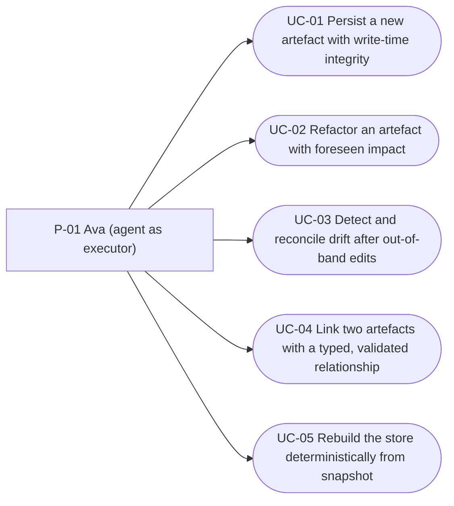

<!-- OKF reserved sub-folder index (docs/product-specs/use-cases/index.md): a directory
     listing, not an artefact concept document — frontmatter-free per
     the `metamodel` skill's `references/artefact-frontmatter.md` §Reserved files. The registry is the body below. -->

# clew — Use Case Registry

The registry of use cases for clew. Each row points to one `uc-NN-{slug}.md` file. A use case is the **actor↔system behavioural scenario** (all paths + guarantees) — it realises FBS functionalities and grounds PRDs; it is not a user story, an FBS row, or a UI spec.

Methodology (kit-only): `spec-use-case/references/methodology.md` — Cockburn textual use cases + UML diagrams + Jacobson Use-Case 2.0.

**Levels:** 🌊 user-goal (default) · ☁🪁 summary · 🐟🦪 subfunction. **Status:** ⬜ draft · 🔄 in progress · ✅ stable.

> **Layout note.** Files live **flat** in this folder, matching the clew-owned registry's canonical `default_path` (`use-cases/uc-{nn}-{slug}.md`) — the kit skill's capability-subfolder layout is a projection this repo does not adopt, since clew's own layout enforcement (C2.3.F03, [ADR-0002](../../architecture/decisions/adr-0002-artefact-file-binding.md)/[ADR-0008](../../architecture/decisions/adr-0008-clew-canonical-source-of-truth-for-metamodel.md)) will hold artefacts to the registry path. The registry below still groups rows by capability for navigation.

## Use Cases by capability

### C2.1 · Stable identifier generation (`id-generation`)

| ID | Use case (goal) | Level | Scope | Primary actor | Realises (FBS) | Status |
|---|---|---|---|---|---|---|
| [UC-01](uc-01-persist-artefact-with-write-time-integrity.md) | Persist a new artefact with write-time integrity | 🌊 | system | [P-01](../../business/01a-personas.md#p-01--ava-the-agent-first-product-engineer) | C2.1.F02–F03 · C2.2.F01–F04 · C2.3.F01–F03 · C4.1.F01/F03 · C5.4.F01 | ⬜ |

### C4.1 · Write-time reference validation (`reference-validation`)

| ID | Use case (goal) | Level | Scope | Primary actor | Realises (FBS) | Status |
|---|---|---|---|---|---|---|
| [UC-02](uc-02-refactor-artefact-with-foreseen-impact.md) | Refactor an artefact with foreseen impact | 🌊 | system | [P-01](../../business/01a-personas.md#p-01--ava-the-agent-first-product-engineer) | C4.1.F01–F03 · C3.2.F03 · C3.1.F02 · C2.2.F03–F04 · C2.3.F01–F02 · C2.1.F02 · C2.4.F02/F04 · C4.2.F01 | ⬜ |

### C4.2 · Drift detection (`drift-detection`)

| ID | Use case (goal) | Level | Scope | Primary actor | Realises (FBS) | Status |
|---|---|---|---|---|---|---|
| [UC-03](uc-03-detect-and-reconcile-drift.md) | Detect and reconcile drift after out-of-band edits | 🌊 | system | [P-01](../../business/01a-personas.md#p-01--ava-the-agent-first-product-engineer) | C4.2.F01–F03 · C2.3.F02 | ⬜ |

### C5.4 · Cross-methodology referencing (`cross-referencing`)

| ID | Use case (goal) | Level | Scope | Primary actor | Realises (FBS) | Status |
|---|---|---|---|---|---|---|
| [UC-04](uc-04-link-artefacts-with-typed-relationship.md) | Link two artefacts with a typed, validated relationship | 🌊 | system | [P-01](../../business/01a-personas.md#p-01--ava-the-agent-first-product-engineer) | C5.4.F01–F02 · C4.1.F01/F03 | ⬜ |

### C2.4 · Deterministic structural export (`structural-export`)

| ID | Use case (goal) | Level | Scope | Primary actor | Realises (FBS) | Status |
|---|---|---|---|---|---|---|
| [UC-05](uc-05-rebuild-store-from-snapshot.md) | Rebuild the store deterministically from snapshot *(casual)* | 🌊 | system | [P-01](../../business/01a-personas.md#p-01--ava-the-agent-first-product-engineer) | C2.4.F01–F03 · C2.1.F01 | ⬜ |

### Planned (not yet authored)

The pre-PRD set (UC-01–UC-05) is complete. Queued next: UC-06+ with E-02's PRD (ad-hoc query, task-scoped context) · brownfield adoption (`clew import md`) at dogfood start · `clew guard`, layer-package enablement, and edge-proposal review are wave-2-gated with [E-04/E-05](../../plans/delivery-roadmap.md#epic-table).

## Actor / use-case overview (optional)

